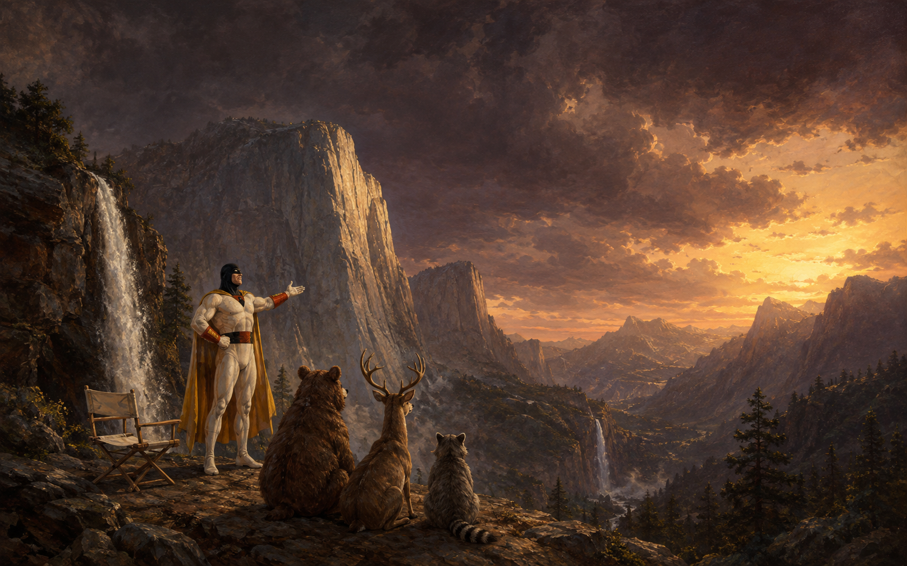

# Space Ghost / Oldbook

A Gruvbox Dark Alpine edge desktop, maintained in Fossil. Warm charcoal and
cream surfaces use amber accents with no window outlines. SwayFX adds soft blur,
restrained corners and shadows; Waybar is a contextual control deck. The gallery
puts Space Ghost and Zorak into cosmic landscapes and suspiciously familiar
paintings. Saved scenes rotate every 20 minutes, with one new painting
attempt per day through the existing Codex login and extra paintings on request.



[The rice, catalogued](RICE.md) lists every piece of eyecandy on this desktop,
old and new, with its trigger, its file, its off switch and its evidence. Its
[tour](RICE.md#take-the-tour) is an ordered checklist for seeing each piece
with your own eyes, and says plainly which ones nobody has watched yet.

## Edit the desktop

`alpine/desktop/` mirrors your HOME. The deployment tool links each file into
place and preserves conflicting files in `~/.local/state/oldbook/backups/`.
Edit the workspace or its installed symlink; both refer to the same source.
Stow is unnecessary for this overlay. Re-run deployment when adding files:

```sh
cd ~/.files
alpine/bin/deploy-home
swaymsg reload
```

| Change | Edit |
| --- | --- |
| Keys, gaps, displays, input | `desktop/.config/sway/config` |
| Blur, shadows, corners, animation | `desktop/.config/swayfx/effects.conf` |
| Panel modules and appearance | `desktop/.config/waybar/config.jsonc`, `style.css` |
| Launcher and notifications | `desktop/.config/fuzzel/`, `desktop/.config/swaync/` |
| Terminals, prompt, editor | `desktop/.config/foot/`, `starship.toml`, `nvim/` |
| GTK and Qt colours | `desktop/.config/gtk-{3,4}.0/gtk.css`, `desktop/.config/qt6ct/` |
| Hold-to-help trigger and LXQt palette | `desktop/.config/hold-to-help/config.toml`, `desktop/.local/share/lxqt/palettes/Gruvbox-Dark` |
| Rotation and generated painting prompts | `wallpapers/gallery.json`, `wallpapers/prompts.json` |
| Active artwork theme and palette | `themes/current`, `themes/gruvbox-dark.json` |
| Window titles and borders | `desktop/.config/sway/theme.conf` |
| Feedback pill and screenshot shutter | `desktop/.local/bin/oldbook-osd`, `oldbook-screenshot`, `desktop/.config/satty/config.toml` |
| Lock screen scene and locker | `desktop/.local/bin/oldbook-lock`, `desktop/.local/lib/oldbook/lock_scene.py` |
| Power deck tiles | `desktop/.config/wlogout/`, `desktop/.local/bin/oldbook-power` |
| Wallpaper crossfade | `desktop/.local/bin/oldbook-background`, `desktop/.local/lib/oldbook/background_fade.py` |
| Terminal splash and Ghostty shaders | `desktop/.config/fastfetch/`, `desktop/.config/ghostty/shaders/` |
| Boot console palette, getty banner, banner initramfs | `system/boot/`, `system/mkinitfs/`, `bin/install-boot-console` |
| Sun, moon, night light, nocturnes | `~/.config/oldbook/location.json`, `desktop/.local/lib/oldbook/astro.py`, `nocturne.py` |
| Keyboard glow modes | `desktop/.local/bin/oldbook-keyboard-backlight`, `desktop/.config/sway/local.d/keyboard-backlight.conf` |
| Window and workspace animations | `desktop/.config/swayfx/animations.conf`, `packages/swayfx/window-animations.patch` |
| Launchpad and Mission Control | `desktop/.local/lib/oldbook/grid_layout.py`, `grid_overlay.py`, `launchpad.py`, `mission_control.py` |
| Desktop breath and the idle gallery | `desktop/.local/lib/oldbook/air.py`, `desktop/.local/bin/oldbook-screensaver`, `~/.config/oldbook/breath.json` |
| Accent elected from the painting | `desktop/.local/lib/oldbook/painting_palette.py`, `desktop/.local/bin/oldbook-palette` |
| Track card and workspace peek | `desktop/.local/bin/oldbook-osd`, `packages/waybar-art/help.c` |
| Cursors and sound cues | `bin/build-cursor-theme`, `bin/build-sound-theme`, `~/.config/oldbook/sound.json` |
| GRUB menu theme | `bin/build-grub-theme`, `system/grub/`, `bin/install-boot-console` |
| Ambient screen brightness | `desktop/.local/bin/oldbook-ambient-display`, `desktop/.local/lib/oldbook/ambient_light.py` |

Waybar reloads CSS automatically; `pkill -USR2 -u "$(id -u)" -x waybar` reloads
its JSON. Restart an application to load its changed theme. Re-running the
user deployment repairs links replaced by application configuration dialogs,
while backing up their newer files.

From a TTY, `sway` selects the installed Space Ghost session. SwayFX takes over
at the next login; an already-running stock Sway session cannot gain compositor
effects from a config reload. `OLDBOOK_STOCK_SWAY=1 sway` is the fallback.

## Useful controls

- **Super+Enter / Super+D:** terminal / applications.
- **Hold Super alone:** contextual shortcut guide; release or press another key
  to dismiss it. Scroll without moving keyboard focus. The physical Caps Lock
  trigger is also configurable in [Hold to Help](../projects/hold-to-help/README.md).
- **Super+Shift+D:** Ghost command deck; the panel's Ghost badge opens it too.
- **Super+G:** painting picker with thumbnails. **Super+Ctrl+Left/Right:** previous/next
  painting, crossfaded; `oldbook-wallpaper next --from X,Y` reveals from a point.
- **Super+Shift+P:** pause/resume rotation. **Super+Shift+N:** notifications.
- **Super+Escape:** lock; the desktop dissolves into the current painting with the
  clock, caption and Scripture. **Super+F:** fullscreen toggle; leave fullscreen to see the panel.
- **Super+Shift+E / click the battery:** power deck (lock, suspend, log out, reboot,
  shut down); Escape closes.
- **Click the notification glyph:** media card, sound and brightness sliders, quick
  actions, then the compact history.
- **Volume, mic and brightness keys:** the new level shows on the bottom-centre pill;
  a muted state greys it.
- **Print / Shift+Print / Ctrl+Print:** capture, then a cream flash and shutter click;
  Satty opens for annotation (Enter copies, Ctrl+S overwrites).
- **Mission Control (F3):** every workspace as a card of live window stills; click or
  Enter to switch, drag a still to move that window. **Launchpad (F4):** every
  application over the blurred painting; type to filter, Enter to launch.
- **Rest on a workspace in the bar:** its windows appear beneath, one still and title
  each. **Right-click the artwork badge:** the next painting grows out of the point
  you clicked.
- **A new track starts:** a card slides in at the bottom right with the album art for
  four seconds; **Now transmitting** in the command deck switches it off.
- **Alt+F6:** ambient keyboard glow from the room's light; **Alt+Shift+F6:** breathe on
  air, where keystrokes deepen the breath and the painting swells with it. Shift+F5
  returns to steady light. **Desktop breath** in the command deck holds the picture
  still.
- **Ambient screen:** command deck → Ambient screen, or `oldbook-ambient-display on`;
  set the brightness by hand any time and it learns the level you like.
- **Leave the desk for four minutes:** the paintings drift and cycle by themselves,
  and come back exactly as they were when you return. Thirty seconds later the display
  eases down and the keyboard takes one last breath; any activity brings both back.
- **Switching workspaces:** the desktop slides sideways in the direction of the
  workspace number, from the next login; `animations disable` in
  `~/.config/swayfx/animations.conf` stops all motion.
- **While the desktop thinks:** the pointer's amber ring turns and breathes.
- **The accent follows the painting:** `oldbook-palette show` explains the current
  choice; `oldbook-palette clear` returns to the theme's amber.
- **Sound cues:** command deck → Sound cues, or `oldbook-sound toggle`;
  `oldbook-sound list` names them.
- **Boot menu:** hold `Shift` or `Esc` at power-on for the Ghost Planet menu; it shows
  itself for three seconds anyway.
- **Night light:** command deck → Night light, or `oldbook-sun-light toggle`; needs
  `~/.config/oldbook/location.json` (copy `location.example.json`). `oldbook-astro status`
  prints today's sun and moon; the masthead shows them once the file exists.
- **New terminal:** the Space Ghost splash appears once per terminal (not in tmux);
  `oldbook-splash` shows it again and `OLDBOOK_SPLASH_LOGO=none` silences it.
- Hover the CPU, network, sound and battery modules to reveal their controls.
- **Super/Command+click the artwork icon:** generate a painting and switch to it.
  The gallery includes the same command, browsing, pause, help, and the full command deck.

[Panel actions](desktop/.config/waybar/README.md) · [Gallery and cron](wallpapers/README.md)

Scripture advances hourly; a manual choice displays immediately and stays for an
hour. Its **History** button opens saved passages, full study material, citations
and notes. Browse older entries and append research or generated material without
losing the original text. Personal history lives in a separate SQLite database;
see [history commands and recovery](verification/scripture-history/README.md).
**Super+/** remains Bible-only and **Super+Shift+/** searches all collections.

[Gruvbox theme guide](themes/README.md) explains live terminal recoloring,
application settings, preserved theme profiles, and themed/general artwork
collections. Folder icons rebuild locally with `alpine/bin/build-icon-theme`.

## Reinstall and rebuild

The Fossil database is `~/.local/share/fossil/files.fossil`; the working branch
is `alpine-oldbook`. Its unversioned store contains content-addressed, signed
APK archives and source inputs. Copy the complete database when moving hosts.
A Git export or checkout alone does **not** include those archived inputs.
After committing changes, create a consistent portable copy:

```sh
alpine/bin/backup-repository --output /path/to/backup/files.fossil
```

The command refuses to replace an existing backup, checks SQLite integrity,
and writes its SHA256 alongside it. Store a copy on another device. This private
copy includes Fossil account credentials. Add `--public` to scrub credentials
and private Fossil metadata from a separate copy before distributing it; review
the stored source and archive contents as well.

[GitHub mirroring and Fossil bootstrap](../docs/GITHUB-FOSSIL.md) documents the
`Spaceghost/.files` mirror on branch `alpine-oldbook`, recovery from GitHub on
another host, and native Fossil replication. After reviewing and committing:

```sh
alpine/bin/publish-git-mirror
```

The helper incrementally exports and pushes that branch without rewriting the
existing GitHub branches. Authenticate once using `gh auth login`, then
`gh auth setup-git`. Successful publication sends the versioned setup to GitHub;
keep the full database backup for archived build inputs.
For automatic publication of new commits every minute, run
`alpine/bin/install-git-mirror-schedule`. The job retries failed pushes and
keeps its result in `~/.local/state/oldbook/git-mirror/status.json`; the guide
above includes authentication, cron setup, logs and removal instructions.
[Bazzite replay](../bazzite/README.md) describes
applying the shared desktop with Fedora-specific session overrides.

[Restore instructions](packages/RESTORE.md) explain installation on a fresh
Alpine base and the isolated root used for verification. The lock preserves
exact signed package bytes and control identities, including build tools.
[Source export](packages/sources.json) restores the inputs for the independently
reproduced [SwayFX](packages/swayfx/README.md) and
[OpenSnitch](packages/opensnitch/README.md) APKs. Codex 0.153.4's complete musl
bundles, code host, app server, sandbox tools and response proxy are archived;
[its installer](packages/codex/README.md) uses no npm.

[Hold to Help](packages/hold-to-help/README.md) also ships source and signed
main/doc APKs with two identical offline builds. It uses the desktop's Qt
palette, fonts and style; local qt6ct and LXQt settings select Gruvbox Dark.

This provides exact binary package restoration and source rebuilds of the
custom packages. It does not claim a source compilation of every Alpine
package or of the upstream Codex bundles. Fresh AI generation is deliberately
nondeterministic: checked-in bitmap hashes preserve the exact existing artwork.
New daily artwork receives an automatic local Fossil checkpoint scoped to its
PNG and provenance JSON; unrelated edits remain untouched. These checkpoints
are published by the minute cron job when enabled, or by a manual
`alpine/bin/publish-git-mirror` run. A failed checkpoint stays
pending and is retried without generating another image.

Disk layout, encryption keys, user passwords, Wi-Fi credentials and Codex login
remain machine-local. On different hardware, adjust output and battery settings before starting Sway.
Backlight controls discover the kernel device automatically; the user should
belong to the `video` group for brightness control. There is no disk-erasing installer.

## Security state

OpenSnitch and its packet gate are active and enabled for boot. A fresh process
produced a real interactive prompt; IPv4/IPv6 filtering and fresh Codex access
passed. Existing saved rules remain in place, so matching connections skip
prompts. See [interactive verification](security/firewall/interactive-verification.json).

Radio-device permissions now preserve status reads while restricting direct
writes to root. Bluetooth is soft-blocked by a verified Bluetooth-only eudev
rule; the existing Wi-Fi connection was preserved. The full Wi-Fi controller
remains staged: exact trusted network
identities and WPA/DHCP integration still need resolution before activation.
Existing unrestricted wheel `doas` authority remains unchanged. Follow the
[radio activation record](security/radio/README.md) for the current scope;
reboot, suspend and physical RF behavior remain unverified.
