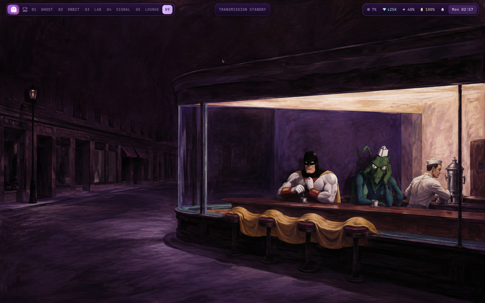

# Space Ghost / Oldbook

A deep-purple Alpine edge desktop, maintained in Fossil. SwayFX adds soft blur,
rounded windows and shadows; Waybar is a contextual control deck. The gallery
puts Space Ghost and Zorak into cosmic landscapes and suspiciously familiar
paintings. Five shipped scenes rotate every 20 minutes, with one new painting
attempt per day through the existing Codex login.



## Edit the desktop

`alpine/desktop/` mirrors your HOME. The deployment tool links each file into
place and preserves conflicting files in `~/.local/state/oldbook/backups/`.
Edit the workspace or its installed symlink; both refer to the same source.
Stow is unnecessary for this overlay. Re-run deployment when adding files:

```sh
cd ~/.files
alpine/bin/deploy-home
swaymsg reload
```

| Change | Edit |
| --- | --- |
| Keys, gaps, displays, input | `desktop/.config/sway/config` |
| Blur, shadows, corners, animation | `desktop/.config/swayfx/effects.conf` |
| Panel modules and appearance | `desktop/.config/waybar/config.jsonc`, `style.css` |
| Launcher and notifications | `desktop/.config/fuzzel/`, `desktop/.config/swaync/` |
| Terminals, prompt, editor | `desktop/.config/foot/`, `starship.toml`, `nvim/` |
| GTK and Qt colours | `desktop/.config/gtk-{3,4}.0/gtk.css`, `theme/spaceghost.conf` |
| Rotation and generated painting prompts | `wallpapers/gallery.json`, `wallpapers/prompts.json` |

Waybar reloads CSS automatically; `pkill -USR2 -u "$(id -u)" -x waybar` reloads
its JSON. Restart an application to load its changed theme. Re-running the
user deployment repairs links replaced by application configuration dialogs,
while backing up their newer files.

From a TTY, `sway` selects the installed Space Ghost session. SwayFX takes over
at the next login; an already-running stock Sway session cannot gain compositor
effects from a config reload. `OLDBOOK_STOCK_SWAY=1 sway` is the fallback.

## Useful controls

- **Super+Enter / Super+D:** terminal / applications.
- **Super+Shift+D:** Ghost command deck; the panel's Ghost badge opens it too.
- **Super+G:** painting picker. **Super+Ctrl+Left/Right:** previous/next painting.
- **Super+Shift+P:** pause/resume rotation. **Super+Shift+N:** notifications.
- **Super+Escape:** lock. **Super+F:** fullscreen toggle; leave fullscreen to see the panel.
- Hover the CPU, network, sound and battery modules to reveal their controls.

[Panel actions](desktop/.config/waybar/README.md) · [Gallery and cron](wallpapers/README.md)

## Reinstall and rebuild

The Fossil database is `~/.local/share/fossil/files.fossil`; the working branch
is `alpine-oldbook`. Its unversioned store contains content-addressed, signed
APK archives and source inputs. Copy the complete database when moving hosts.
A Git export or checkout alone does **not** include those archived inputs.
After committing changes, create a consistent portable copy:

```sh
alpine/bin/backup-repository --output /path/to/backup/files.fossil
```

The command refuses to replace an existing backup, checks SQLite integrity,
and writes its SHA256 alongside it. Store a copy on another device.

[Restore instructions](packages/RESTORE.md) explain installation on a fresh
Alpine base and the isolated root used for verification. The lock preserves
exact signed package bytes and control identities, including build tools.
[Source export](packages/sources.json) restores the inputs for the independently
reproduced [SwayFX](packages/swayfx/README.md) and
[OpenSnitch](packages/opensnitch/README.md) APKs. Codex 0.153.4's complete musl
bundles, code host, app server, sandbox tools and response proxy are archived;
[its installer](packages/codex/README.md) uses no npm.

This provides exact binary package restoration and source rebuilds of the
custom packages. It does not claim a source compilation of every Alpine
package or of the upstream Codex bundles. Fresh AI generation is deliberately
nondeterministic: checked-in bitmap hashes preserve the exact existing artwork.
New daily artwork receives an automatic local Fossil checkpoint scoped to its
PNG and provenance JSON; unrelated edits remain untouched. Nothing is published
or synced. A failed checkpoint stays pending and is retried without generating
another image.

Disk layout, encryption keys, user passwords, Wi-Fi credentials and Codex login
remain machine-local. On different hardware, adjust output and battery settings before starting Sway.
Backlight controls discover the kernel device automatically; the user should
belong to the `video` group for brightness control. There is no disk-erasing installer.

## Security state

OpenSnitch is installed and its custom packet gate passed isolated IPv4/IPv6
allow/deny and daemon-failure tests. The live gate and radio controller remain
staged pending their separate integration. A purple indicator is not evidence
of enforcement. See `security/` and [current verification](PROGRESS.md).
