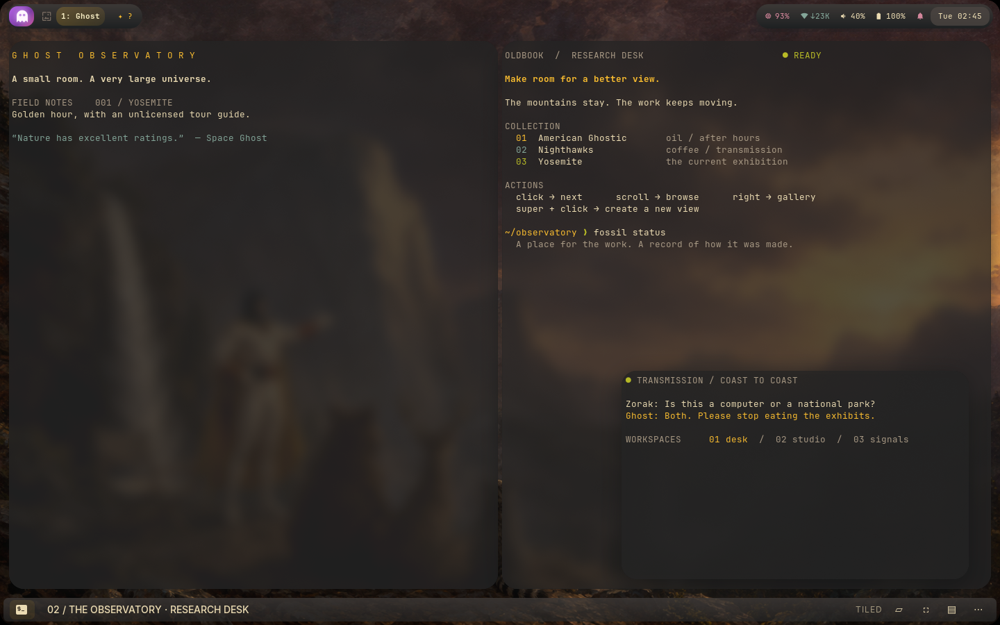
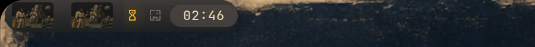
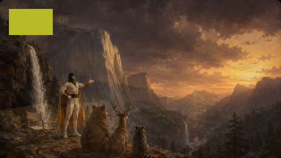
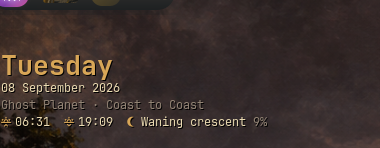
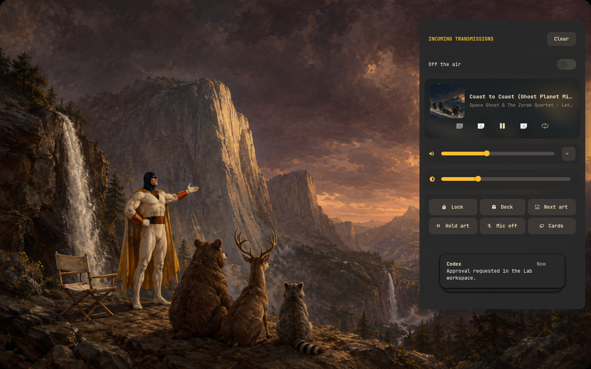
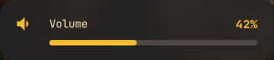
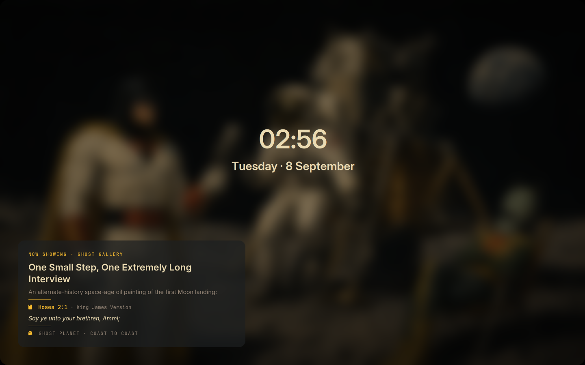
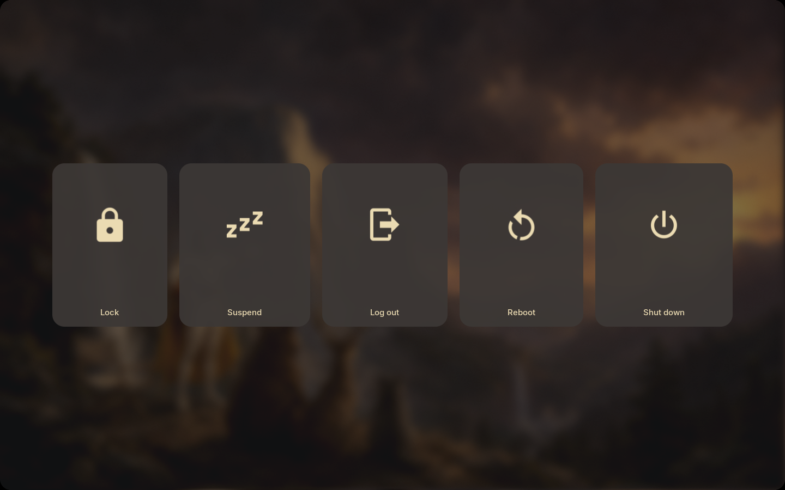
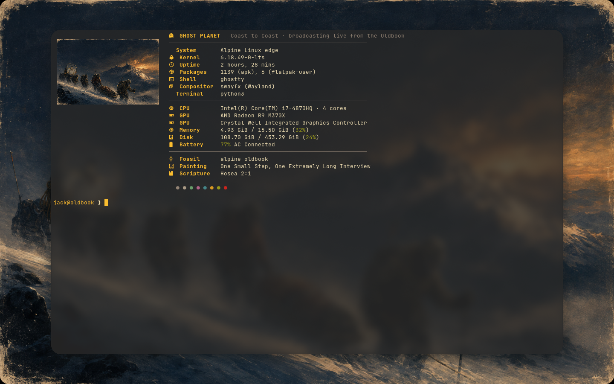

# The rice, catalogued

Everything on this desktop that exists to be looked at, in one place: the
SwayFX glass, the control deck, the gallery and its crossfade, the reading
cards, the lock screen, the boot console, the keyboard glow, the terminals.
Each entry says what it looks like, how to trigger it, where to tweak it, how
to switch it off, and where the evidence lives. Paths are relative to
`alpine/`; design notes for the 2026-09-08 round are under
[`../docs/superpowers/specs/`](../docs/superpowers/specs/) and the behaviour
contracts live in [FEATURES.md](FEATURES.md).

Three words recur in the evidence notes. **Live** means seen on the physical
2880×1800 panel. **Headless** means rendered in a private SwayFX session with
the real configuration and photographed with grim; it proves layout and
behaviour, not blur (the pixman renderer has none), frame pacing or sound.
**Next boot** means the change is installed but the screen it changes has not
been shown since. Nothing below claims a physical check that was not made.

Most application files exist twice: the shared source under
`desktop/` and the authored copy under `themes/profiles/gruvbox-dark/`.
`readlink ~/.config/<path>` tells you which one is live; keep edits identical
in both, or run `oldbook-theme sync` after editing the desktop copy.

## Keys and pointer, on one page

| Do this | Get this |
| --- | --- |
| `Super+Enter`, `Super+D` | Ghostty with the Space Ghost splash; the application launcher |
| Hold `Super` for half a second | Contextual shortcut guide (Hold to Help); release or press a key to dismiss |
| `Super+Shift+D`, click the Ghost badge | The command deck |
| `Super+G` | Painting picker with thumbnails; `Super+Ctrl+Left/Right` previous/next painting, crossfaded |
| `Super+Shift+P` | Pause or resume the twenty-minute rotation |
| `Super+Shift+G` | Desktop reading cards off and on |
| `Super+/`, `Super+Shift+/` | Scripture search in the desktop bar, Bible only or every collection |
| `Super+Shift+N`, click the bell | Notification centre: track card, sliders, quick actions, history |
| `Super+Escape` | Lock: the desktop dissolves into the blurred painting |
| `Super+Shift+E`, click the battery | Power deck: lock, suspend, log out, reboot, shut down |
| `Super+Tab`, `Alt+Tab`, Mission Control (F3) | Window carousel with still previews, recent order |
| Launchpad (F4) | Application launcher, leaving an overview first |
| `Super+E`, three fingers up | Expo, the workspace and window picker |
| Four fingers up / down | Clear the desktop / restore it, or open the carousel when nothing is hidden |
| Three or four fingers left / right | Next or previous workspace |
| Four-finger pinch in | Application launcher |
| `Super+1`…`9`, `Super+0` | Workspaces Ghost, Orbit, Lab, Signal, Lounge, 6–9, and Strata on 10 |
| Super + backtick, `Super+~` | Drop-down console (Ghostty), drop-down monitor (btop in Foot) |
| `Super+Space`, `Super+Shift+Space` | Float; float at 90% of the workspace, centred |
| `Super+=`, `Super+-`, `Super+C` | Grow or shrink from the centre; centre and raise |
| `Super+Ctrl+B` | Return the caption strip to the bottom edge |
| `Super+Shift+V` | Clipboard history picker |
| `Super+i`, `Super+Shift+i`, `Super+N` | Next AI window; agent menu; agent session picker |
| `Print`, `Shift+Print`, `Ctrl+Print` | Screenshot with flash and shutter click, then Satty |
| Volume, mic and brightness keys | The change shows on the bottom-centre pill |
| `F5` / `F6` | Keyboard light down / up, also while locked |
| `Shift+F6` / `Shift+F5` | Slow breath / steady light |
| `Ctrl+F6`, `Ctrl+F5` | Typing pulse; typing shadow |
| `Ctrl+Shift+F6`, `Ctrl+Shift+F5` | The same two, gated by sustained typing speed |
| `Alt+F6` | Ambient glow from the room's light |
| `Alt+Shift+F6` | Breathe on air: keystrokes fill the lungs (landing today, see below) |
| `Caps Lock` | Escape; the key's LED becomes the AI attention light |
| Artwork badge: left, right, middle, scroll | Picker; next; pause; browse. Super+click paints; Shift+click edits prompts; Super+Shift+click invents a theme |
| Hover CPU, network, sound, battery | Drawers slide out with memory and thermals, radio and firewall, microphone, brightness and keep-awake |
| Caption strip: left, middle, Shift+right | Window picker; float toggle; the decoration editor |

## Compositor

**Glass, corners and shadows.** SwayFX 0.6 (a local package with the
screen-corner patch) draws two-pass blur behind translucent surfaces, 22-pixel
window corners with `smart_corner_radius` off so gaps keep every window
rounded, 34-pixel soft shadows offset ten pixels down, a two-percent dim on
unfocused windows and no outline pixel anywhere. Bars and launcher layers get
18-pixel corners, the power deck and the OSD get blur behind them by layer
namespace. Tweak `desktop/.config/swayfx/effects.conf` (and the profile copy);
Sway itself keeps gaps at 6 inner and 7 outer in `desktop/.config/sway/config`.
Off: `OLDBOOK_STOCK_SWAY=1 sway` at the next login, or edit the values. The
Ghost Observatory geometry is the 2026-09-08 change; the compact 6-pixel
corners and 3/4 gaps are one `fossil diff` away. Evidence: headless renders in
[verification/ghost-observatory/](verification/ghost-observatory/README.md);
the physical frame rate with the larger shadow radius is unobserved.

**Rounded screen.** The output itself is masked with 20-pixel black corners
after the whole scene is drawn, including overlays, fullscreen surfaces, the
lock and the software cursor. It comes from `packages/swayfx/screen-corners.patch`
and `oldbook-sway` exports `SPACEGHOST_SCREEN_CORNER_RADIUS`; set it to `0`
before starting Sway to disable the mask. Evidence and limits:
[verification/screen-corners/](verification/screen-corners/README.md).

**Fullscreen etiquette.** While a window is fullscreen the bar fades to
30 percent and comes back on hover; `oldbook-waybar-dim` writes one imported
stylesheet only when the state changes. Off: remove its block from
`oldbook-session`. Evidence: [workspace-chrome](verification/workspace-chrome/fullscreen.png).

## Control deck bar

The Waybar at the top is a 34-pixel floating strip with 6-pixel margins, split
into a left island, a bare centre and a right island (`desktop/.config/waybar/config.jsonc`,
`style.css`, both copies). CSS reloads on save; JSON needs
`pkill -USR2 -u "$(id -u)" -x waybar`. The [panel actions](desktop/.config/waybar/README.md)
table lists every click.

**Ghost badge.** The white, purple and pink Space Ghost glyph is the one
element no theme may recolour (`GHOST-BRAND`). Left opens the command deck,
right the launcher. Evidence: [verification/ghost-branding/](verification/ghost-branding/base.png).

**Artwork badge.** The badge shows a 22-pixel rounded thumbnail of the painting
on screen; paused rotation dims it, a running generation swaps in the amber
hourglass, and a missing thumbnail falls back to the gallery glyph. It is the
native module in `packages/waybar-art/art.c` (package `oldbook-waybar-art`
r10), fed by `oldbook-wallpaper status --thumbnail-height` and a debounced
watch on `current-wallpaper.png`. Tweak `#custom-art` in `style.css`; roll back
by reinstalling the archived r9 APK (see the [spec](../docs/superpowers/specs/2026-09-08-thumbnails.md)).
Evidence: headless states in [verification/gallery-thumbnails/badge.png](verification/gallery-thumbnails/badge.png),
confirmed live on the panel.

**Workspace labels.** Workspaces 1–5 are Ghost, Orbit, Lab, Signal and Lounge;
the active number and name are bold and bright, the largest displayed
application is appended after a middle dot in a quieter weight, and Codex or
ChatGPT windows earn a star. The ✦ button jumps to the next AI window. Tweak
`desktop/.local/lib/oldbook/workspace_model.py`; names are in `sway/config`.
Evidence: [workspace-ready](verification/workspace-ready/README.md).

**Music centre.** Previous, play/pause with the track, and next sit directly on
the bar while an MPRIS player exists; the track accepts play/pause, previous,
next and five-second seeks, and Pithos gets delayed single-click playback,
double-click open, right-click show/hide, middle-click tired and Super+middle
ban. Evidence: [waybar-music](verification/waybar-music/music.png),
[pithos-controls](verification/pithos-controls/music.png).

**Signal meter.** A ten-bar spectrum from cava follows the media controls
while something plays, collapses after half a second of silence and stops cava
entirely when nothing plays; it has no clicks or tooltip and costs about four
percent of one core with music. Feeder: `desktop/.local/bin/oldbook-cava-bar`.
Off: delete `"custom/cava"` from `modules-center` in both `config.jsonc`
copies. Evidence: [verification/bar-visualizer/](verification/bar-visualizer/README.md)
(headless render, live bar strip seen).

**Drawers and tooltips.** CPU, network, sound and battery are groups that slide
out on hover: memory, thermal core and root storage; radio and firewall state;
the microphone; brightness and keep-awake. Every module carries a Space Ghost
tooltip that says what each click does. The clock keeps Los Angeles time with
a scrollable calendar. Tweak the `group/*` entries in `config.jsonc`.

## Gallery

**Paintings.** The gallery is Space Ghost and Zorak dropped into landscapes,
histories and suspiciously familiar paintings, generated through the Codex
login: one daily attempt by cron and more on request (`oldbook-wallpaper
generate`, Super+click on the badge). Scenes, insertions and mediums in
`wallpapers/prompts.json` combine so no subject repeats; the shared guidance
carries hard reverence limits. Every PNG lives under `assets/gallery/` with a
sidecar recording prompt, hash and provenance. The [gallery guide](wallpapers/README.md)
has the whole workflow. Evidence of the pipeline lives beside each painting.

**Rotation.** All workspaces share one painting and one twenty-minute timer;
`Super+Shift+P` or the badge's middle click pause it. Timer choices mix the
active theme's collection with unthemed art; manual browsing reaches every
collection. Tweak `wallpapers/gallery.json`.

**Crossfade.** `oldbook-background` owns a surface on the background layer,
above Sway's swaybg, and eases between paintings on the frame clock: 1.6 s
for the timer, 0.8 s for a deliberate change, and `--from X,Y` on `next`,
`prev`, `select` or `refresh` reveals the new painting from that point with a
soft radial edge. It starts on the image swaybg is showing so logins and
reloads fade instead of cutting, re-creates its surface when a respawned
swaybg covers it, and asks the desktop cards to return on top. Off:
`oldbook-background quit` returns the gallery to plain cuts until the next
login; remove its block from `oldbook-session` to keep it off. Evidence:
seven headless frames in [verification/background-crossfade/](verification/background-crossfade/README.md);
one live `next`/`prev` faded on the panel; physical frame pacing is unmeasured.

**Picker thumbnails.** `Super+G` lists every painting with a rounded thumbnail
beside its title on 40-pixel rows, then the gallery actions. Fuzzel resolves
dmenu icons through the icon theme, so the cache under
`~/.cache/oldbook/thumbnails/` is published as a private `Oldbook-Thumbnails`
theme. Library: `desktop/.local/lib/oldbook/thumbnails.py`. Off: delete the
cache and the theme directory; rows fall back to text. Evidence:
[verification/gallery-thumbnails/picker.png](verification/gallery-thumbnails/picker.png)
(headless), confirmed live.

**Themed collections and new themes.** `themes/current` names the collection
the timer and the daily painting use; each descriptor under `themes/<id>.json`
carries a palette, an image style and the design fields (font, radius,
spacing, opacity, bar and widget edges). Super+Shift+click on the badge invents
a complete random theme with a debut painting; Super+Shift+right-click asks for
a description. The eighteen earlier themes are preserved under `archive/`.
Evidence: [gallery-themes](verification/gallery-themes/launcher.png),
[launcher-themes](verification/launcher-themes/gallery-paged.png).

**Nocturnes after dark.** With a location file in place (see Sun and moon),
the timer draws night paintings with three times the weight of the rest
between sunset and sunrise, never excluding anything and never touching manual
browsing. A sidecar may say `"time_of_day": "night"`; otherwise whole words
such as night, moon, dusk, candle or aurora in the title or story qualify.
Logic: `desktop/.local/lib/oldbook/nocturne.py`. Off: remove the location
file. Evidence: seeded weighting in `tests/test_astro.py`; a full night of live
rotation has not been watched.

**Video background.** `oldbook-video-background FILE` plays a muted loop
beneath windows with mpvpaper; the command deck offers a picker and a stop.
Nothing starts automatically.

## Desktop reading cards

Transparent Conky cards are seated on the calm parts of each painting by
`oldbook-conky layout`, which scores the wallpaper's detail and brightness,
keeps clear of the bar, the edges and the scripture bar, and tunes each card's
text colour until it clears a contrast ratio over the pixels it covers. The
placement is cached per painting. They are reading, not telemetry
(`CONKY-READING`): `Super+Shift+G` hides them, the gallery picker refits them,
and `desktop/.config/conky/panels.json` (both copies) defines them. The
[panels guide](desktop/DESKTOP-PANELS.md) covers the policy and the clicks.

**Masthead.** The weekday in bold, the date, "Ghost Planet · Coast to Coast",
and since 2026-09-08 a sun-and-moon line: sunrise and sunset glyphs and times,
the moon's phase glyph, name and lit fraction, refreshed every five minutes by
`oldbook-astro panel` from an explicit location file. Evidence:
[verification/sun-and-moon/masthead-headless.png](verification/sun-and-moon/masthead-headless.png)
(headless); the card was refitted live but not photographed.

**Scripture.** A passage, its citation, a reflection and a practice, advancing
hourly from the bundled King James text, Torah, Talmud and curated
reflections. Click advances, right-click steps back along your own path, the
**History** link opens saved reading and notes. The desktop search bar takes
`Super+/` (Bible) and `Super+Shift+/` (every collection) and holds a manual
choice for an hour. Evidence: [scripture-selection](verification/scripture-selection/after.png),
[scripture-header](verification/scripture-header/README.md).

**Witness, Ghost Gallery, Coast to Coast, Power.** Quotations from outside
(click advances), the current painting's story, the rotating journal (three
quips per dated note, four-minute cadence, a personal SQLite database behind
`oldbook-journal`), and the battery bar. Evidence:
[desktop-journal](verification/desktop-journal/panels.png),
[conky-policy](verification/conky-policy/panels.png).

## Notifications

**Placement.** SwayNC popups sit on the top layer with no exclusive zone, so
nothing moves or loses focus; the empty host is transparent and only the cards
are styled. Config `desktop/.config/swaync/config.json`, style in both
`style.css` copies. Evidence: [verification/notifications/](verification/notifications/compact-history-card.png),
[notification-overlay](verification/notification-overlay/popup.png).

**Control centre.** `Super+Shift+N` or the bell opens INCOMING TRANSMISSIONS:
an "Off the air" switch, the playing track as a card whose blurred album art
is its own backdrop, the output volume with a per-application drawer, the
panel brightness slider with a floor that cannot black out the display, and a
grid of six quick actions (Lock, Deck, Next art, and the toggles Hold art, Mic
off and Cards, refreshed each time the panel opens), then the compact history.
Widgets are additive; remove any name from `widgets` in `config.json` and run
`swaync-client -R`. Evidence: [verification/swaync-widgets/](verification/swaync-widgets/README.md)
(headless with a fake player); the live panel reloaded but was not
photographed.

**Attention light.** Codex and Claude completions or approvals light the Caps
Lock LED through `oldbook-notification-led` until the window is visited;
ordinary notices never light it. Off: remove its launch from `oldbook-session`.

## Windows

**Caption strip.** Window titles live in `oldbook-decoration`, a translucent
gradient strip at the workspace's bottom edge (saved: bottom, opacity 0.67,
radius 7) that attaches to a focused floating window and follows it. Since
2026-09-08 it uses the theme's design face, Inter Medium a point above the
terminal size, left-aligned, with letter-spaced state text and a 28-pixel
minimum height. Left click opens the window picker, middle click toggles
floating, Shift+right-click opens `oldbook-decoration-settings`, `Super+Ctrl+B`
returns it to the bottom. Tweak `~/.config/oldbook/decoration.json` through the
editor. Evidence: [decoration-context](verification/decoration-context/bottom-strip.png),
[decoration-framerate](verification/decoration-framerate/README.md),
[ghost-observatory](verification/ghost-observatory/production-floating.png).

**Window carousel.** `Super+Tab`, `Alt+Tab`, the Mission Control keycap or a
four-finger swipe down open an angled carousel of every window across
workspaces in true recent order, with aspect-correct still captures taken once
per opening without visiting them. Hold to browse, Shift reverses, release
selects, Escape returns home; quick taps alternate the last two windows.
Evidence: [carousel-quality](verification/carousel-quality/README.md),
[window-navigation](verification/window-navigation/README.md).

**Expo and show desktop.** `Super+E` or three fingers up opens the Fuzzel
workspace and window picker; four fingers up clears the desktop and down
restores it (or opens the carousel when nothing is hidden). Evidence:
[gestures](verification/gestures/expo.png), [show-desktop](verification/show-desktop/midflight.png).

**Sizing and raising.** `Super+=` and `Super+-` grow or shrink from the centre,
`Super+Shift+Space` floats at 90 percent with breathing room, `Super+C` centres
and raises, and a floating window raises itself after the pointer rests on it
for a second. Evidence: [near-full-resize](verification/near-full-resize/near-full.png),
[center-window](verification/center-window/centered-raised.png),
[hover-raise](verification/hover-raise/README.md).

**Drop-downs and Strata.** Super+backtick summons a persistent Ghostty
console and `Super+~` a btop monitor in Foot, docked below the bar at 94
percent width on the current workspace; `Super+0` is workspace 10, Strata,
where the local Fossil review browser lives. Evidence:
[ghostty-dropdown](verification/ghostty-dropdown/live.png),
[console-monitor-foot](verification/console-monitor-foot/monitor.png),
[strata](verification/strata/desktop.png).

## Input and Apple keys

**Gestures.** Three or four fingers left and right change workspace, up and
down drive Expo or show-desktop, a four-finger pinch opens the launcher; two
fingers stay with the application. `desktop/.config/sway/gestures.conf`; the
[gesture guide](desktop/GESTURES.md) has the table.

**Engraved keys.** F3 opens the carousel, F4 the launcher, F5 and F6 the
keyboard light, all without Fn; Fn keeps the function keys. Caps Lock is
Escape (Shift included). Evidence: [apple-overview](verification/apple-overview/private-key-fixture.png).

**Hold to Help.** Hold either Super alone for half a second and a scrollable
overlay lists the focused application's shortcuts, the active Sway mode and
the tmux and system controls, without taking focus; release or press a key to
dismiss. It is the standalone [Hold to Help](../projects/hold-to-help/README.md)
package, themed from the Qt palette. Tweak `desktop/.config/hold-to-help/config.toml`.
Evidence: [superhold-guide-dev1](verification/superhold-guide-dev1/guide-dark.png).

**Keyboard glow.** One whole-keyboard Apple SMC light, one worker, and a
family of modes that persist across logins (`desktop/.local/bin/oldbook-keyboard-backlight`,
bindings in `desktop/.config/sway/local.d/keyboard-backlight.conf`, all of them
also in the command deck's Keyboard glow menu):

- `F5` / `F6` step the level, down to fully off, even while locked.
- `Shift+F6` breathes on a six-second cycle; `Shift+F5` returns to steady.
- `Ctrl+F6` brightens on each keypress and decays; `Ctrl+F5` starts bright and
  darkens as you type; the `Ctrl+Shift` variants react only above about 22
  words per minute.
- `Alt+F6`, **ambient**, follows the room through the SMC light sensor: keys
  at the saved peak in the dark, off in daylight, a smooth log-scale curve in
  between, retargeting only when the smoothed reading moves and fading over
  1.2 s so nothing jumps. The same sensor is the subject of an upstream pull
  request adding an `applesmc` backend to wluma (details in the
  [ambient spec](../docs/superpowers/specs/2026-09-08-ambient-glow.md)).
- `Alt+Shift+F6`, **breathe on air**, is landing as this page is written: the
  breath starts shallow and slow and every keystroke adds a sip of air that
  deepens and quickens it, leaking away over about twenty seconds of quiet.
  Check `oldbook-keyboard-backlight status` for the mode name before relying
  on the binding.
- The idle stage's **last breath** (below) is an overlay, never a saved level.

Evidence: [keyboard-breathing](verification/keyboard-breathing/README.md),
[keyboard-ambient](verification/keyboard-ambient/README.md) with live sensor
readings. A 60 Hz target is not a measured optical refresh.

**Clipboard.** `Super+Shift+V` opens the history picker; `Super+Ctrl+Shift+V`
deletes an entry. Evidence: [clipboard](verification/clipboard/history-menu.png).

## Feedback

**The pill.** Volume, mute, microphone, display brightness and keyboard light
changes show a 300×66 capsule at the bottom centre of the focused output: a
Nerd Font glyph, label, amber bar and percentage from the active palette, on
the overlay layer with no reserved space, no focus and pointer pass-through,
held 1.1 s and faded on the frame clock. `oldbook-osd` is the daemon;
`oldbook-osd show --kind volume --value 40` drives it; `oldbook-osd preview
--output pill.png` renders it without a display. Off: remove its block from
`oldbook-session`; the key helpers then fall silent rather than fail. Evidence:
[verification/osd/](verification/osd/README.md) (headless); the live daemon
mapped the pill on the panel while the display was off, so the physical blur,
shadow and fade await a look.

**Shutter.** After grim writes a screenshot the output flashes a cream wash for
120 ms, `pw-play` clicks the freedesktop camera shutter, and Satty opens with a
Gruvbox profile (Enter copies and closes, Ctrl+S overwrites; Swappy remains the
fallback). Tweak `desktop/.local/bin/oldbook-screenshot` and
`desktop/.config/satty/config.toml`. Off: uninstall `sound-theme-freedesktop`
to silence it, `satty` to return to Swappy. Evidence: [osd/flash.png](verification/osd/flash.png),
[osd/satty.png](verification/osd/satty.png); the sound has not been heard live.

## Idle and lock

**Stages.** swayidle runs three: at 270 s the display eases to 20 percent
over 1.5 s and the keyboard takes one last breath (rising to its peak, then
falling to dark over 4.5 s); at 300 s the session locks; at 600 s the display
switches off. Activity restores the display level and keyboard exactly.
Helpers: `oldbook-idle dim|undim`, `oldbook-keyboard-backlight last-breath`.
Off: remove the `timeout 270` pair from the swayidle line in `oldbook-session`.
Evidence: tests in `tests/test_idle_dim.py` and live readings in
[keyboard-ambient](verification/keyboard-ambient/README.md).

**Lock screen.** `Super+Escape` dissolves the desktop over 0.4 s into the
current painting blurred, darkened and vignetted, with an Inter Display clock
and date on a ring that stays invisible until you type, when the amber ring
and key highlights appear; a caption card in the lower corner carries the
painting's title and first sentence, the hour's Scripture reference and its
opening words, and the Ghost Planet mark. No grace period, empty passwords
ignored. The locker is `swaylock-effects` rebuilt as `oldbook-swaylock-effects`
beside stock swaylock, with the readiness handshake backported so
`oldbook-lock` keeps its serialised, identity-checked acquisition and falls
back to swaylockd and stock swaylock inside the same call. Scenes are cached
under `~/.cache/oldbook/lock/`; `oldbook-lock prerender` warms the cache. Off:
`OLDBOOK_LOCK_BACKEND=stock`, or `doas apk del oldbook-swaylock-effects`.
Evidence: [verification/lock-screen/](verification/lock-screen/README.md)
(headless idle, typing, cleared, Caps Lock, relock); the live session has not
yet been locked with the new design, so your first `Super+Escape` is the check.

## Power deck

`Super+Shift+E` or a left click on the battery opens wlogout over the blurred
desktop: five charcoal tiles with Nerd Font glyphs (lock, suspend, log out,
reboot, shut down; keys `l` `u` `e` `r` `s`, Escape closes) that turn amber on
hover or focus. Suspend locks first; log out, reboot and shut down ask on a
Gruvbox swaynag bar. `oldbook-power` is the script, `desktop/.config/wlogout/`
the layout and style, `bin/build-wlogout-icons` rasterises the glyphs. Off:
uninstall wlogout or delete the config directory and the fuzzel session menu
returns automatically. Evidence: [verification/power-deck/](verification/power-deck/README.md)
(headless); the binding, the battery click and a physical tile press await a
look.

## Terminals

**Ghostty and Foot.** Both run at 78 percent opacity with the Gruvbox
sixteen-colour palette, four-pixel padding (three in the derived profile copy)
and an amber cursor; Foot recolours live windows without closing them
(`oldbook-refresh-terminal-theme`). Ghostty additionally runs two shaders:
`warm-bloom.glsl` lifts bright amber and cream pixels through an eight-tap
ring, and `cursor-smear.glsl` draws a parallelogram from the previous cursor
cell to the current one, tinted with the cursor colour, retreating over
150 ms; both animate only while focused. Files under
`desktop/.config/ghostty/shaders/`, enabled by `custom-shader` lines in both
config copies. Off: delete those lines. Evidence:
[terminal-chrome](verification/terminal-chrome/ghostty-cursor-smear-slowed.png)
(headless, slowed shader); both shaders loaded live on the GPU.

**Splash.** The first interactive shell in a new terminal (never in tmux) runs
`oldbook-splash`: fastfetch beside the Space Ghost painting, drawn through
Ghostty's kitty file medium or a libsixel stream in Foot (a text ghost
elsewhere), with Gruvbox keys, the Fossil branch, the painting on screen, the
hour's Scripture reference and the track on air. `OLDBOOK_SPLASH_LOGO=none`
silences it; `oldbook-splash` shows it again. Config
`desktop/.config/fastfetch/config.jsonc` and the guard in both `.zshrc` copies.
Evidence: [splash-ghostty-kitty.png](verification/terminal-chrome/splash-ghostty-kitty.png),
[splash-foot-sixel.png](verification/terminal-chrome/splash-foot-sixel.png),
both confirmed live.

**Prompt, shell, tmux.** Starship shows user, host, directory, the Fossil
branch with a glyph, git status and slow-command timing in Gruvbox colours;
zsh colours `eza` and completion listings from the same palette with no
framework; tmux keeps its status at the top, amber for the session name and
the active pane border, charcoal tabs. Files: `desktop/.config/starship.toml`,
`desktop/.zshrc`, `desktop/.tmux.conf`.

**Neovim.** A hand-rolled statusline with a mode-coloured block, file and
modified dot, the Fossil or git branch refreshed asynchronously, diagnostics,
filetype and position, plus a winbar, thin `▏` splits and a blank end of
buffer; no plugin manager. Both `init.lua` copies. Evidence:
[neovim-chrome-foot.png](verification/terminal-chrome/neovim-chrome-foot.png)
(headless only).

**btop and cava.** btop uses the `spaceghost` theme with rounded boxes and
braille graphs on a transparent background; the standalone cava draws a
green-to-orange gradient. Files under `desktop/.config/btop/` and
`desktop/.config/cava/config`.

## Launchers and menus

**Fuzzel.** Every desktop menu is Fuzzel with icons, 18-pixel corners, a
48-column width and colours passed in from the active palette by
`oldbook-fuzzel`; `desktop/.config/fuzzel/fuzzel.ini` holds the geometry.
Evidence: [launcher-themes](verification/launcher-themes/gruvbox.png).

**Command deck.** `Super+Shift+D` or the Ghost badge: applications, Expo,
window switch, decoration placement, the gallery, YouTube and the video
background, Ghostty, the reactor, transmissions, the sound studio, the
keyboard glow menu, **Night light**, the firewall, notifications, the Fossil
checkout, the session menu and help. Script: `desktop/.local/bin/oldbook-control`.

**YouTube.** A launcher entry searches and plays through yt-dlp and mpv as a
floating picture-in-picture or pinned behind the desktop. Evidence:
[youtube](verification/youtube/pip-mode.png).

## Sun and moon

An explicit `~/.config/oldbook/location.json` (copy
`desktop/.config/oldbook/location.example.json`: name, latitude, longitude,
timezone) is the only source of location; nothing is inferred or fetched.
With it, `astro.py` computes sunrise, sunset, civil twilight and the moon's
phase offline from the NOAA equations and a low-precision lunar series,
verified against published times within minutes. The masthead shows the line,
`oldbook-sun-light run` execs wlsunset with the coordinates so the display
warms after sunset (`toggle` or the deck's Night light stops it, and a stop
survives reloads), and the gallery prefers nocturnes at night. `oldbook-astro
status` prints today's figures. Off: delete the location file. Evidence:
`tests/test_astro.py`, [verification/sun-and-moon/](verification/sun-and-moon/README.md);
the physical colour ramp has not been watched through an evening.

## Boot chain

**Console palette and font.** The GRUB command line now carries the sixteen
Gruvbox console colours (`vt.default_red`, `vt.default_grn`, `vt.default_blu`),
a cream-on-charcoal default attribute (`vt.color=0x0F`) and the kernel's
built-in Terminus 16×32 (`fbcon=font:TER16x32`), so the passphrase prompt,
kernel messages and the rescue gettys share the palette from the first frame.
The gettys on tty2–tty6 print a Ghost Planet masthead from `/etc/issue`.
Sources under `system/boot/`, installer `bin/install-boot-console`
(idempotent, backs up to `/var/backups/alpine-rice/boot-console-<ns>/`,
regenerates `grub.cfg` into a temporary file and keeps it only after
`grub-script-check` and a structural proof that the stock entry is unchanged).
Off: `--rollback <backup dir>`. **Next boot:** nothing here has been seen yet;
the [system guide](system/README.md) has the commands.

**Ghost Planet initramfs.** A second, non-default GRUB entry boots
`/boot/initramfs-lts-ghost`, the stock mkinitfs init plus one guarded block
that prints a Gruvbox masthead before the LUKS prompt; `/boot/initramfs-lts`
and the default entry are untouched. Press an arrow during the one-second menu
to try it; `--remove-ghost` withdraws it; rerun the installer after a kernel
upgrade. **Next boot:** never booted. Design and adoption steps:
[luks-prompt spec](../docs/superpowers/specs/2026-09-08-luks-prompt.md).

## Theming system

**Descriptor and profiles.** `themes/gruvbox-dark.json` is the source of the
palette, the image style for new paintings and the design fields (Inter,
radius 22, spacing 6, opacity 0.78, bar on top, widgets on the right, launcher
width 48). `oldbook-theme list|use|sync` switches complete themes: the
authored profile under `themes/profiles/gruvbox-dark/` is linked into HOME,
missing application files are rendered from the shared desktop copies by
`wallpapers/desktop_theme.py`, and a matching painting is selected. Every
theme must be complete (`THEME-COMPLETE`); palette-only themes are rejected.
The [theme guide](themes/README.md) explains live recolouring and the
preserved profiles. Evidence: [theme-review](verification/theme-review/gruvbox-dark.png),
[complete-themes](verification/complete-themes/astronomers-vigil.png) (an
archived generated theme, kept as proof of the pipeline).

**Icons, cursor, toolkits.** `Oldbook-Gruvbox` is Papirus with warm gold
folders rebuilt offline by `bin/build-icon-theme`; the cursor is
`simp1e-cursors-gruvbox-dark` at 24; GTK 3 and 4 use `adw-gtk3-dark` with a
semantic Gruvbox palette in `gtk.css`, Qt 6 a matching `qt6ct` palette also
installed system-wide, and LXQt a named `Gruvbox-Dark` palette for Hold to
Help. Files under `desktop/.config/gtk-3.0/`, `gtk-4.0/`, `qt6ct/` and
`desktop/.local/share/`.

## Sound

The desktop is quiet by design. The only cue is the camera shutter after a
screenshot (`sound-theme-freedesktop` through `pw-play`); Pithos provides the
music the bar, the cava meter, the notification centre and the splash refer
to. Notifications, the lock and the power deck make no sound.

## Verification ledger

| Item | Live on the panel | Headless render | Not yet seen |
| --- | --- | --- | --- |
| Ghost Observatory geometry | reload applied | yes | corners, shadows and frame rate by eye |
| Artwork badge thumbnail | yes | yes | |
| Signal meter | bar strip seen | yes | |
| Crossfade | one next/prev | yes | frame pacing, hotplug, fresh login |
| Picker thumbnails | yes | yes | |
| Sun and moon line | refitted | yes | eye check, a full night of nocturnes, the wlsunset ramp |
| Notification centre widgets | reloaded | yes | eye check |
| Feedback pill and flash | pill mapped while the display was off | yes | look, sound |
| Lock screen | | yes | the first live lock, Caps Lock text, dissolve pacing |
| Dim before lock, last breath | sysfs readings | | eye check of the ramp |
| Ambient glow | live sensor readings | | a covered sensor over minutes |
| Breathe on air | | | landing; check the mode name |
| Power deck | | yes | binding, battery click, tile press |
| Splash and shaders | yes | yes | Neovim chrome, drop-down console reflow |
| Boot console, LUKS prompt, banner entry | | | everything, until the next boot |

The earlier features carry their own evidence directories under
[verification/](verification/) and their contracts in [FEATURES.md](FEATURES.md);
[PROGRESS.md](PROGRESS.md) keeps the chronology and its honest gaps.
