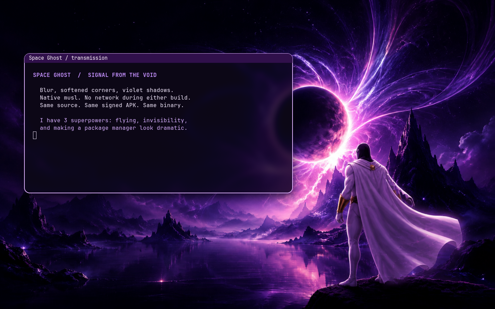

# SwayFX for Oldbook

Native musl SwayFX 0.6 adds blur, rounded corners, shadows and window animations.
It installs as `/usr/bin/swayfx` alongside stock `/usr/bin/sway`; the existing
compositor and its tools remain available. The release is based on Sway 1.12.0
and uses Alpine's sceneFX 0.5 and wlroots 0.20 libraries.

## Edit and enable

`oldbook-effects.conf` is the violet-glass example, also packaged under
`/usr/share/swayfx/`. Include it only from a configuration loaded by SwayFX;
stock Sway cannot parse these effects. A user configuration may symlink to this
workspace file so visual edits take effect on a compositor reload.

Starting a different compositor ends the current graphical session. Validate a
prepared configuration first, then select SwayFX at the next normal login.
The parallel package does not switch sessions or add an autostart service.

## Build without network

Restore the repository APK lock first so compiler and shared-library inputs
match `build-environment.json`. Install the development dependencies listed in
`APKBUILD`. Use your existing local abuild signing key; keep its private half
outside the checkout.

Export the content-addressed source archive from this Fossil repository:

```sh
fossil uv export sha256/ec382be4afc7daeb7cb988a02abba6b1e4af26108c0dcc7a8fbb69c2bb15589b/swayfx-0.6.tar.gz /tmp/swayfx-0.6.tar.gz
alpine/packages/swayfx/build-offline --source /tmp/swayfx-0.6.tar.gz --work /tmp/swayfx-build
```

The helper requires a new work directory. It checks source SHA-256, disables
networking with `unshare --net`, and runs abuild as the ordinary user. It neither
installs dependencies nor changes the APK database. The resulting signed APK is
under `WORK/apks/oldbook/x86_64/`. Installation is a separate `apk add` operation.

Sources are pinned to upstream commit `fd71a6bdc061bd633b488ae7b83e8a6981d22f86`;
`manifest.json` records source/package hashes and Fossil artifact names. When
changing recipe inputs, regenerate APKBUILD checksums before building.

## Verification

Two builds in separate directories, both without networking, produced the same
signed APK and executable byte for byte. `apk verify` passed. The native musl
binary parsed every example effect and rendered on both AMD and Intel GLES2
backends with a headless output. This does not prove physical display takeover,
suspend/resume or battery performance.

After installing the package, run a contained rendering check:

```sh
alpine/packages/swayfx/verify-headless --binary /usr/bin/swayfx --wallpaper alpine/assets/spaceghost.png --output /tmp/swayfx-render-test --render-device /dev/dri/renderD129
```

Choose an available DRM render node on another machine. The script creates its
own runtime directory, synthetic terminal and screenshot; it leaves the active
Sway session alone. `verification.json` records evidence and remaining limits.



Upstream: [SwayFX 0.6](https://github.com/wlrfx/swayfx/releases/tag/0.6),
[configuration and build instructions](https://github.com/wlrfx/swayfx/tree/fd71a6bdc061bd633b488ae7b83e8a6981d22f86).
