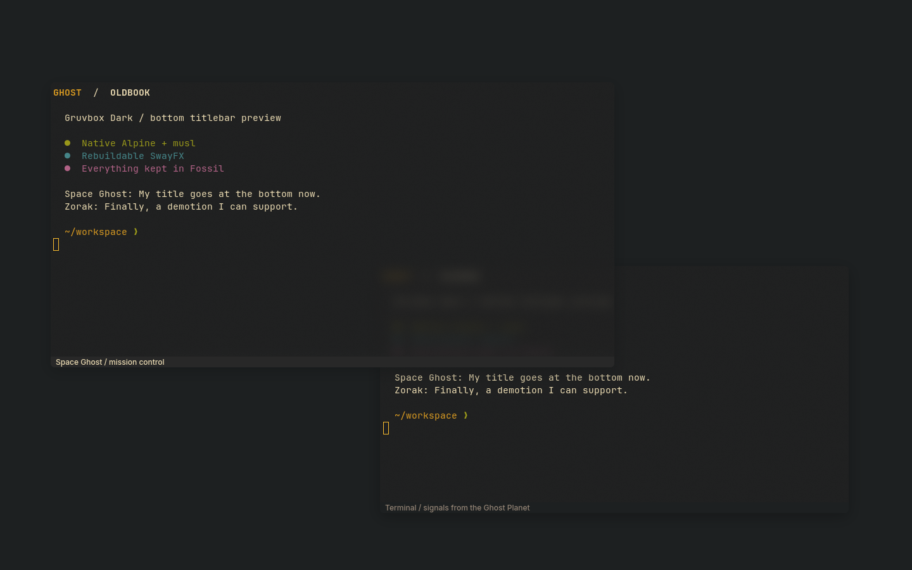

# SwayFX for Oldbook

Native musl SwayFX 0.6 adds blur, rounded corners, shadows and window animations.
It installs as `/usr/bin/swayfx` alongside stock `/usr/bin/sway`; the existing
compositor and its tools remain available. The release is based on Sway 1.12.0
and uses Alpine's sceneFX 0.5 and wlroots 0.20 libraries.

## Bottom window titles

The local `bottom-titlebar.patch` adds `titlebar_position top|bottom` for normal
per-window decorations. The desktop selects `bottom` in
`desktop/.config/swayfx/config`, with zero-width window borders. The focused-app
title and media controls remain in Waybar, centered between its other sections.
Tabbed and stacked group headers keep their existing placement and controls.

Only this patched SwayFX accepts the new command. Keep it out of the shared
stock Sway configuration. `titlebar_position top` restores upstream placement;
`OLDBOOK_STOCK_SWAY=1 sway` selects the retained stock compositor at login.

## Edit and enable

`hover-raise.patch` adds `mouse_raise_delay 0..60000` in milliseconds. The package
default is zero (disabled); the desktop's `sway/local.d/hover-raise.conf` selects
1000 with a quiet runtime IPC command. Both stock Sway and an older running
SwayFX still parse this include. They ignore the unsupported runtime request;
the new behavior begins after the patched package starts at the next graphical
login. Installing an executable or reloading the old process cannot replace the
running compositor. Do not terminate the current session automatically.

Focus follows pointer entry immediately. A floating window rises after one
second of continuous dwell over that same window, including movement inside
it. Pointer leave (even onto empty space while focus remains), a newer focus,
workspace or geometry changes, mouse actions, fullscreen and locking cancel
the pending raise. The timer rechecks the actual compositor hit target and
raises the existing window without changing focus or moving the pointer.
Keyboard focus alone never starts a timer. No background input reader is used.

Set the include's runtime value to zero to disable this behavior persistently;
`swaymsg 'mouse_raise_delay 0'` disables it in a patched running session.

`oldbook-effects.conf` is the violet-glass example, also packaged under
`/usr/share/swayfx/`. Include it only from a configuration loaded by SwayFX;
stock Sway cannot parse these effects. A user configuration may symlink to this
workspace file so visual edits take effect on a compositor reload.

Starting a different compositor ends the current graphical session. Validate a
prepared configuration first, then select SwayFX at the next normal login.
The parallel package does not switch sessions or add an autostart service.

## Build without network

Restore the repository APK lock first so compiler and shared-library inputs
match `build-environment.json`. Install the development dependencies listed in
`APKBUILD`. Use your existing local abuild signing key; keep its private half
outside the checkout.

Export the content-addressed source archive from this Fossil repository:

```sh
fossil uv export sha256/ec382be4afc7daeb7cb988a02abba6b1e4af26108c0dcc7a8fbb69c2bb15589b/swayfx-0.6.tar.gz /tmp/swayfx-0.6.tar.gz
alpine/packages/swayfx/build-offline --source /tmp/swayfx-0.6.tar.gz --work /tmp/swayfx-build
```

The helper requires a new work directory. It checks source SHA-256, disables
networking with `unshare --net`, and runs abuild as the ordinary user. It neither
installs dependencies nor changes the APK database. The resulting signed APK is
under `WORK/apks/oldbook/x86_64/`. Installation is a separate `apk add` operation.

Sources are pinned to upstream commit `fd71a6bdc061bd633b488ae7b83e8a6981d22f86`;
`manifest.json` records source/package hashes and Fossil artifact names. When
changing recipe inputs, regenerate APKBUILD checksums before building. The
offline helper copies the versioned patch into the recipe, and abuild checks
its checksum before applying it to the archived source.

## Verification

For the preceding r1 package, two builds in separate directories, both without networking, produced the same
signed APK and executable byte for byte. `apk verify` passed. The native musl
binary parsed every example effect and rendered on both AMD and Intel GLES2
backends with a headless output. The rebuilt package also passed 22 bottom-title
checks: tiled/floating geometry, pointer drag/resize, fullscreen edge pixels,
border modes, grouped headers and multiple floating windows on stacked layouts.
This does not prove physical display takeover, suspend/resume or battery performance.

The r2 hover behavior is verified separately in
`alpine/verification/hover-raise/`. Run its private compositor check with:

```sh
alpine/packages/swayfx/verify-hover-raise --binary /usr/bin/swayfx --output /tmp/swayfx-hover-test
```

This exercises pointer dwell, cancellation, timing and floating stacking with
synthetic windows; it also proves that the existing criteria `focus` command
raises an already focused floating window on this pinned SwayFX version.

After installing the package, run a contained rendering check:

```sh
alpine/packages/swayfx/verify-headless --binary /usr/bin/swayfx --wallpaper alpine/assets/spaceghost.png --output /tmp/swayfx-render-test --render-device /dev/dri/renderD129
```

Choose an available DRM render node on another machine. The script creates its
own runtime directory, synthetic terminal and screenshot; it leaves the active
Sway session alone. `verification.json` records evidence and remaining limits.

Verify bottom-caption geometry and real pointer interactions too:

```sh
alpine/packages/swayfx/verify-bottom-titlebar --binary /usr/bin/swayfx --output /tmp/swayfx-bottom-test --render-device /dev/dri/renderD129
```

This uses a private Wayland virtual pointer and synthetic Foot clients. It does
not inject input into the live desktop. The compiler, Wayland development tools,
Foot, grim and Python GdkPixbuf dependencies are retained in the package lock.

Pass `--theme-profile spaceghost` or `--theme-profile gruvbox-dark` to check the
authored theme's captions, terminal palette, and effects. The test also exercises
the production middle-click binding: the caption toggles floating twice, while
the same click inside terminal content leaves tiling alone. Each profile saves
its own screenshot and JSON evidence.



Upstream: [SwayFX 0.6](https://github.com/wlrfx/swayfx/releases/tag/0.6),
[configuration and build instructions](https://github.com/wlrfx/swayfx/tree/fd71a6bdc061bd633b488ae7b83e8a6981d22f86).
