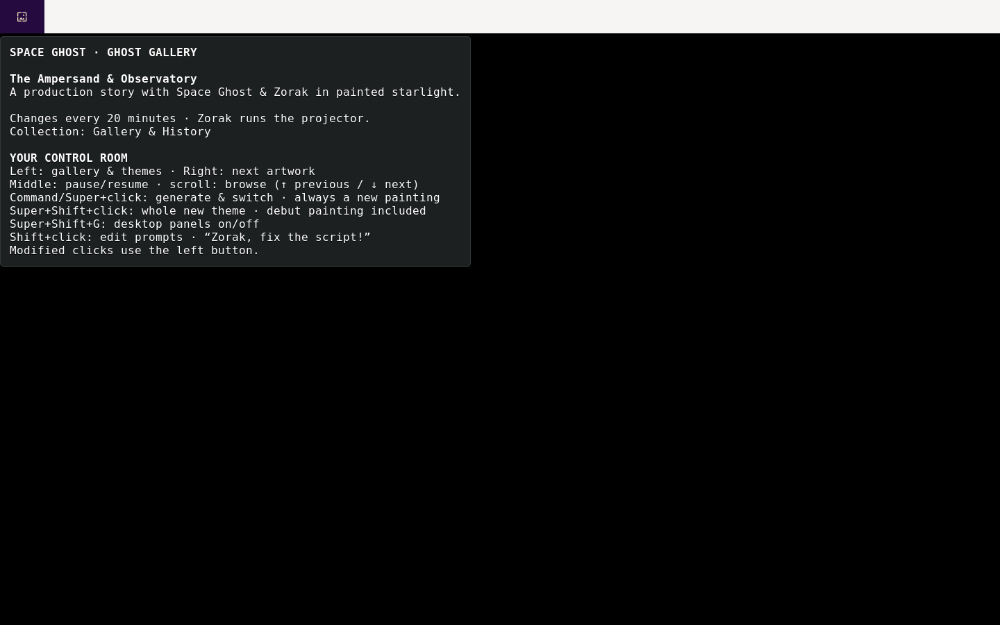

# Artwork button for Waybar

This small native musl CFFI widget adds three actions to the original artwork
button: **Command/Super + left click** generates and switches, **Shift +
left click** opens the prompt editor, and **Command/Super + Shift + left click**
creates a random named theme and switches to its first painting through the
gallery's existing new-theme generator. Left click opens the gallery, right
click advances to the next image, middle click pauses, and scrolling moves to
the previous or next image. Super/Command + Shift + right click opens a free-form theme description;
the generator invents its name and creates a complete desktop design and first
painting. Empty input or Escape cancels. Other right, middle and scroll actions
keep their usual behavior. The
widget displays the complete tooltip, icon and state classes from
`mbp-intel-wallpaper status` without rewriting the help text. A bounded startup
walk also adds contextual hover help to Waybar's workspace, focused-window,
mode and CPU widgets, whose stock modules do not accept custom tooltip formats.
It reads and escapes each widget's current label or native tooltip only while
GTK asks for help, and retains no window titles.

Workspace labels use Pango attribute ranges: the active number and workspace
name are bold and bright, inactive numbers stay bold with regular names, and
process suffixes remain regular and subdued. Reserved empty names such as
`4: Signal` and `10: Strata` retain those attributes in both Titlecase and
legacy uppercase spelling. Named colors
`mbp_intel_workspace_active` and `mbp_intel_workspace_secondary` come from the
selected Waybar stylesheet. Labels remain plain text, including literal Unicode
and markup characters, so workspace names and click commands stay intact.

Waybar 0.15 has no custom-module modifier mapping. Its documented CFFI ABI lets
this widget handle only its own pointer events. Unfocused layer-shell panels
receive no GTK keyboard modifiers, so the callback also checks the current
Left/Right Meta and Shift state with Linux `EVIOCGKEY`. It first requires the
device to advertise ordinary keyboard keys, preventing a stale modifier bit on
a non-keyboard input node from changing a normal click. The desktop user needs
read access to `/dev/input/event*`, supplied here by the existing `input` group
membership. It never reads the input event stream, stores key history, changes
focus or adds global Sway bindings. This implements the MacBook's physical
Command and Shift keys.

## Build and install

Source and the upstream ABI header are versioned in this checkout. The recipe
needs `build-base pkgconf gtk+3.0-dev json-glib-dev`; development headers are not
runtime dependencies. Restore the package lock before rebuilding exact inputs.

```sh
alpine/packages/waybar-art/build-offline --work /tmp/waybar-art-build
doas apk add --no-network /tmp/waybar-art-build/apks/mbp-intel/x86_64/mbp-intel-waybar-art-1.0.0-r9.apk
```

The helper creates a fresh work directory and builds with networking disabled,
using the build user's private abuild key outside the checkout. The library is
installed at `/usr/lib/waybar/mbp-intel-art.so`; configuration remains symlinked to
`alpine/desktop/.config/waybar/config.jsonc`. Source edits require rebuilding the
package and restarting Waybar. `verification.json` records two-build hashes.
`manifest.json` records the exact signed r9 APK identity and archived artifact.

## Verify

Check actual Waybar workspace text attributes across focus changes and renames,
with screenshots in both desktop themes:

```sh
alpine/packages/waybar-art/verify-workspaces-headless \
    --module /usr/lib/waybar/mbp-intel-art.so --output /tmp/waybar-workspace-emphasis
```

This uses a private compositor and D-Bus with synthetic Foot windows. Its GTK
inspector reads the rendered labels' weight and color ranges without changing
them. The smaller native fixture in `tests/workspace-emphasis.c` covers label
replacement, dynamic workspace buttons and cleanup under fatal GTK warnings.

Check real hover tooltips from the production status helper, including rotating,
paused and generating states:

```sh
alpine/packages/waybar-art/verify-tooltip-headless \
    --helper "$HOME/.local/bin/mbp-intel-wallpaper" --output /tmp/waybar-art-tooltips
```

This uses a private HOME and compositor, moves only a private virtual pointer,
and saves popup screenshots. It never requests generation. The Python artwork
tests also parse the complete tooltip with Pango: a raw ampersand in an
instruction used to invalidate the entire popup despite passing text-only tests.

```sh
alpine/packages/waybar-art/verify-headless --module /usr/lib/waybar/mbp-intel-art.so --output /tmp/waybar-art-test
```

The test requires `sway waybar build-base pkgconf wayland-dev grim` and `doas` for a temporary
uinput keyboard. It disables the exact synthetic devices in existing Sway
sessions before creation, injects real Command and Shift state and pointer
events into a contained panel, and holds a fake Meta bit on a non-keyboard
device to guard against modifier contamination. Every action goes to a stub; it
never generates an image. Screenshots and interaction checks are retained in
the output.

Render the contextual help against Waybar's real Sway and CPU modules:

```sh
alpine/packages/waybar-art/verify-help-headless \
    --module /usr/lib/waybar/mbp-intel-art.so --output /tmp/waybar-help-test
```

This second private compositor uses only a synthetic window title, activates a
synthetic resize mode, and saves workspace, focused-window, CPU and mode hover
screenshots without logging desktop window titles.



Upstream: [CFFI ABI documentation](https://github.com/Alexays/Waybar/blob/0.15.0/man/waybar-cffi.5.scd),
[standard event mapping](https://github.com/Alexays/Waybar/blob/0.15.0/src/AModule.cpp).
