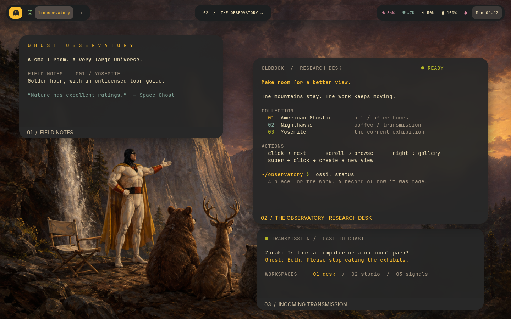

# Ghost Observatory



A native concept preview: warm Gruvbox charcoal, generous rounded corners,
and understated amber captions beneath each window. Windows read like exhibits;
the archived Yosemite painting remains visible around the work, including its
overconfident Space Ghost tour guide. The instrument bar retains the production
modules, click/scroll actions, tooltip help, and focused title between its sides.

This is a visual proposal, not a production theme change. Its larger windows,
spacing, and captions exist only inside a temporary headless compositor.
Terminal prose is synthetic preview content; bar telemetry is real and may vary.
The production session, its gaps, applications, and active wallpaper are untouched.

From the Fossil checkout, with the bottom-titlebar SwayFX package installed:

```sh
python3 alpine/themes/concepts/ghost-observatory/preview --output /tmp/ghost-observatory
```

Before installation, pass `--binary /path/to/patched/output/sway/sway`.
Use a new output directory for each run. `--render-device /dev/dri/renderD129`
selects another GPU. The script uses the repository's pinned artwork and existing
SwayFX, Foot, Waybar, and Grim; no network access or image generation is needed.
It saves a native screenshot, compositor tree, logs, and binary/artwork hashes,
then terminates only processes it created. The archived input is reproducible;
live clock and telemetry values do not promise identical screenshot bytes.
The checked-in `preview.png` was rendered with the installed patched compositor;
`preview-evidence.json` records its binary and artwork hashes.

## Status

Adopted in production on 2026-09-08: corners, shadows, blur, gaps, bar islands,
tooltips, launcher radius and caption typography now live in the Gruvbox Dark
profile and the shared desktop templates. The centre window title and the
amber Ghost badge shown here were not adopted (`BAR-LAYOUT`, `GHOST-BRAND`),
and captions stay on the oldbook-decoration strip. `alpine/themes/preview`
renders the production configuration the same way this script rendered the
concept; see [verification/ghost-observatory](../../../verification/ghost-observatory/README.md).
