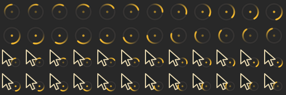

# Oldbook Ghost cursors



The top two rows are `watch`, the bottom two are `left_ptr_watch`: twenty-four
frames each at 28 milliseconds, so the amber comet takes 672 milliseconds to come
around, the same beat as the Simp1e set the theme inherits. The ring also
breathes once per turn, widening about four percent and brightening as it goes,
and the eye at the centre keeps time with it. The strip is rendered by
`alpine/bin/build-cursor-theme --strip`, which draws the same cairo frames that
are packed into the theme, so it is the artwork itself rather than a mock-up.

`session.json` records a private headless SwayFX session started with
`XCURSOR_THEME=Oldbook-Ghost` and `XCURSOR_SIZE=48`: the compositor reached its
socket, reported its seat, and logged no cursor complaint. Reproduce both:

```sh
python3 alpine/bin/build-cursor-theme --strip /tmp/frames.png
python3 alpine/tests/verify_cursor_theme.py --output /tmp/cursor-session
```

Limits: a headless session draws no pointer, so nothing here is a photograph of
the cursor turning on the physical panel. The format, the sizes, the hotspots,
the frame counts and the delays are covered by `alpine/tests/test_cursor_theme.py`;
the contact sheet shows the artwork; the session proves the compositor accepts
the theme by name. Seeing it spin is the user's own check, next time something
keeps the desktop waiting.
