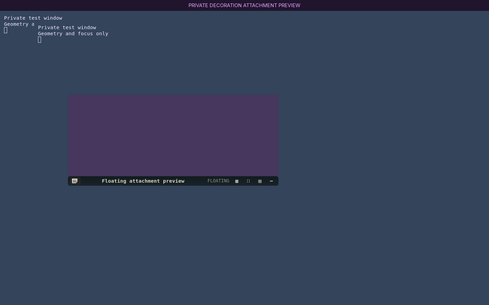

# Keep captions on ordinary windows while using the console

The caption's geometry and action context follow the same filtered Sway focus
history. Opening `com.oldbook.dropdown`, legacy `oldbook-dropdown`, or
`com.oldbook.monitor` leaves the
caption attached to the preceding ordinary window. Its geometry remains live;
closing that window cannot leave a stale action target. Leaving the console
resumes ordinary focus immediately. Ordinary terminals remain eligible for
captions. Fullscreen flags on these drop-downs, including wrappers containing
only them, do not override the ordinary caption; ordinary fullscreen siblings
retain the existing bottom-edge policy.

Four initial regression failures reproduced the former console attachment, and
five further fullscreen cases reproduced its unwanted edge changes. All 47
decoration unit tests pass after the change. The native SwayFX verifier passed
34 checks, including six console/monitor show/hide checks and the existing hover,
drag, resize, fullscreen and workspace transitions. The private fixture uses
Foot windows with the current and legacy app IDs; it never changes host focus
or desktop settings. The first monitor-extended run timed out during private
compositor startup before any test; its evidence is retained, and the unchanged
source passed on retry.

`native-evidence.json` retains compositor geometry, focus and source hashes.
`summary.json` records the commands and check counts. `activation.json` records
the final targeted daemon restart (24615 to 28213), its tested entry-point
hash and a single mapped caption. The initial activation is preserved in
`activation-initial.json`. Saved appearance stayed byte-identical; activation
sent no window or focus commands.

Recovery: restore the preceding versions of `decoration.py`,
`decoration_actions.py` and `decoration_placement.py`, then restart only the
decoration daemon. Existing appearance and floating handoff settings are
unchanged.
