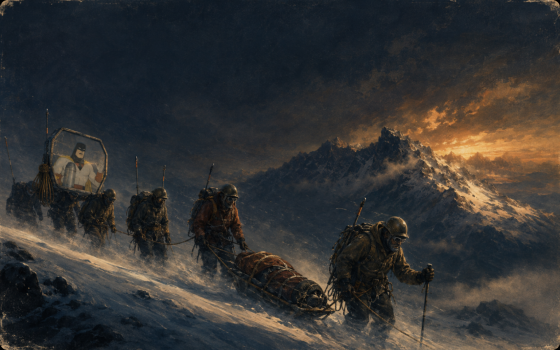
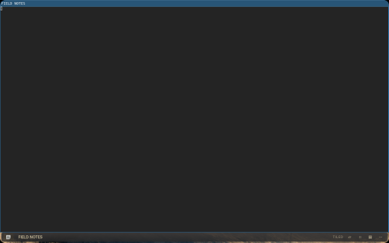
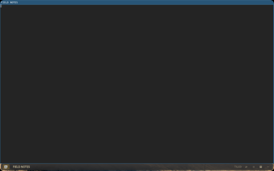

# The painting breathes with the keyboard




`alpine/tests/verify_desktop_breath.py --part breath` publishes a synthetic air
record into a private runtime directory, exactly as the keyboard worker does,
and watches what `oldbook-background` makes of it. The session is private: its
own headless SwayFX compositor, runtime directory, HOME and XDG directories.

The daemon reports the view transform it is drawing through, so the measurement
is the real number rather than a guess from pixels:

| Frame | State | Scale |
| --- | --- | --- |
| 01 | no air | 1.000 |
| 02 | full lungs, top of the breath | 1.018 |
| 03 | resting lungs, top of the breath | 1.006 |
| 04 | the worker stopped | 1.000 |
| 05 | breathing, preference off | 1.000 |

All six checks passed: the painting starts untouched, full lungs swell it to the
documented ceiling and no further, resting lungs swell it only a little, the
breath settles back to exactly 1.000 when the worker stops, and the preference
in `~/.config/oldbook/breath.json` holds it perfectly still.

The frames are scaled down from 1440x900. The pixman renderer draws no blur, so
these prove the geometry and the settling, not the compositor's glass. A swell
of 0.6% is deliberately hard to see in a still frame; the transform column is
the evidence, and the physical impression on the 2880x1800 panel is not proven
here.

## The caption strip




`--part caption` runs the real caption daemon over a synthetic Foot window in
the same kind of private session and measures the average colour of the bottom
band of the frame across four states. Three checks passed:

| State | Bottom-band average (R, G, B) |
| --- | --- |
| keystroke breath, empty lungs | 44.359, 44.232, 43.910 |
| keystroke breath, top of the breath | 44.514, 44.342, 43.908 |
| plain six-second breath | 44.359, 44.232, 43.910 |
| the worker stopped | 44.359, 44.232, 43.910 |

The accent wash behind the brand button brightens with the keystroke breath and
is numerically identical to the resting strip for the plain breath and after the
breathing stops, which is the contract: only the breath you are filling yourself
moves the caption. The band average moves by a fraction of a level because the
brand button is a small part of a wide strip; that is the intended subtlety.

```sh
python3 alpine/tests/verify_desktop_breath.py --output /tmp/breath --part breath
python3 alpine/tests/verify_desktop_breath.py --output /tmp/caption --part caption
```
