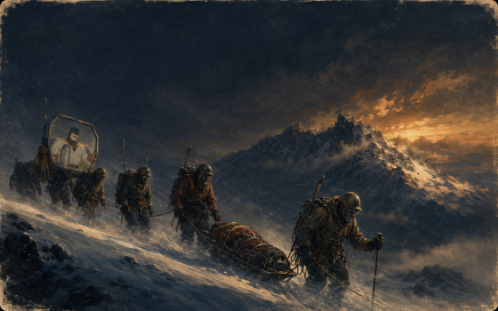
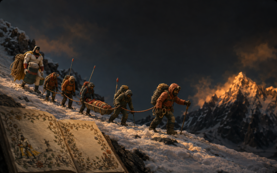

# The idle gallery






`alpine/tests/verify_desktop_breath.py --part screensaver` starts the idle
gallery over two real paintings in a private headless SwayFX session, with a
four-second hold so a loaded machine can still capture frames between changes.
The live stage holds each painting for thirty seconds.

The daemon reports the view transform it draws through, and the pan direction
reverses between segments:

| Frame | State | Transform (scale, dx, dy) |
| --- | --- | --- |
| 01 | before | 1.000, 0.0, 0.0 |
| 02 | drifting across the first painting | 1.013, -5.3, -1.2 |
| 03 | drifting across the second, the other way | 1.018, +5.2, +1.1 |
| 04 | stopped and restored | 1.000, 0.0, 0.0 |

All eight checks passed. The two that matter most: the shared painting link
`~/.local/share/oldbook/current-wallpaper.png` still pointed at the original
painting while the screensaver was cycling, and after `stop` the daemon glided
back to rest and crossfaded to exactly that painting. The gallery's saved
selection, rotation deadline and pause switch are never written by this path.

The frames are scaled down from 1440x900 and drawn by the pixman renderer, which
has no blur. Physical frame pacing of the drift on the 2880x1800 panel is not
proven here.

```sh
python3 alpine/tests/verify_desktop_breath.py --output /tmp/saver --part screensaver
```
