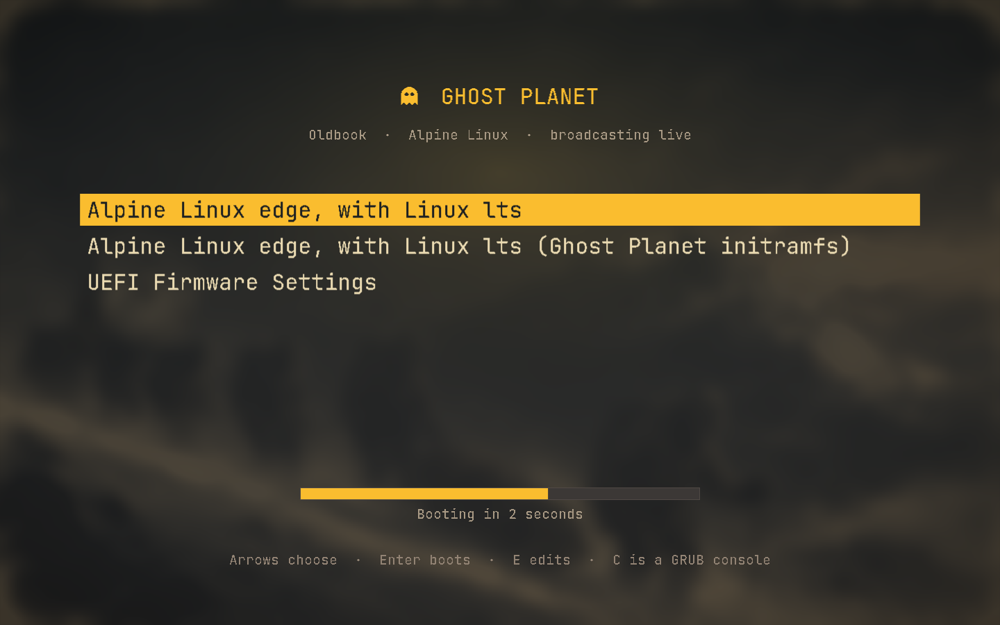

# Ghost Planet GRUB menu



This picture is a **simulation, not GRUB**. `alpine/system/grub/render-preview`
reads the committed `theme.txt`, decodes the committed PF2 fonts with the same
parser the tests use, and draws the labels, entries, selection bar and progress
bar at their declared positions. It proves the fonts carry renderable glyphs and
the layout numbers land where they were meant to. It cannot prove GRUB's own
gfxmenu agrees: `grub-emu` is not packaged for this machine, so the real menu
stays unverified until the next boot. GRUB also draws the countdown text inside
the progress bar rather than under it, which is the one place the simulation
knowingly differs.

The menu entries shown are the three the live `grub.cfg` actually contains.

## What was checked on this machine

- `grub-script-check` accepts the generated `/boot/grub/grub.cfg`.
- The stock entry keeps its title, kernel, initramfs, root and crypt
  parameters, stays first and stays the default.
- The generated config carries `set theme`, `insmod gfxmenu`, `insmod png`,
  both `loadfont` lines from the theme directory, `set timeout=3` and
  `set timeout_style=menu`.
- A second install run changed nothing.
- Every replaced file is backed up under `/var/backups/alpine-rice/`.

`evidence.json` records the font sizes, hashes and the exact checks.

## Why the fonts are compiled here

GRUB draws menus with its own bitmap format, PF2, and `grub-mkfont` is not
packaged for this machine. The stock `unicode.pf2` is sixteen pixels tall, which
is a smear on a 2880x1800 panel. `alpine/bin/build-grub-theme` therefore renders
JetBrains Mono with Pango, thresholds the glyphs to the one-bit bitmaps PF2
stores, and writes the format directly through
`alpine/system/grub/grub_theme.py`. `alpine/tests/test_grub_theme.py` round-trips
the writer against its own parser and checks the shipped fonts carry printable
ASCII and the Nerd Font ghost.

```sh
alpine/bin/build-grub-theme                       # regenerate the theme
alpine/bin/build-grub-theme --check               # is the committed theme current?
alpine/system/grub/render-preview --output p.png  # redraw this picture
doas alpine/bin/install-boot-console              # install it
doas alpine/bin/install-boot-console --remove-theme
```
