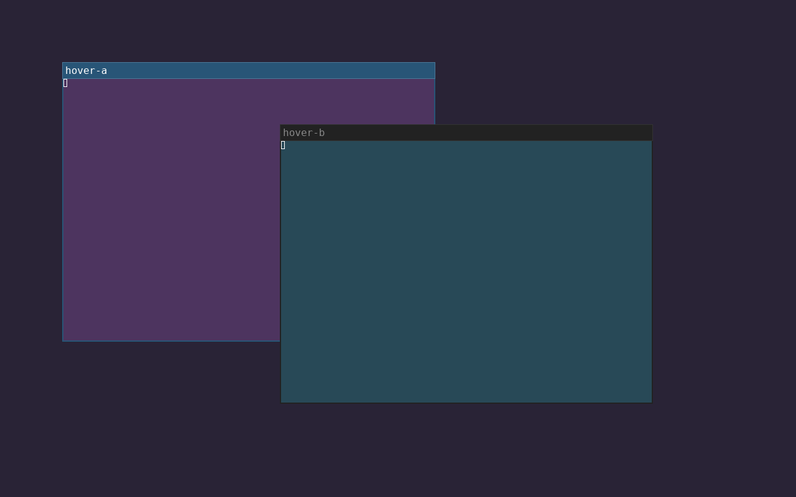
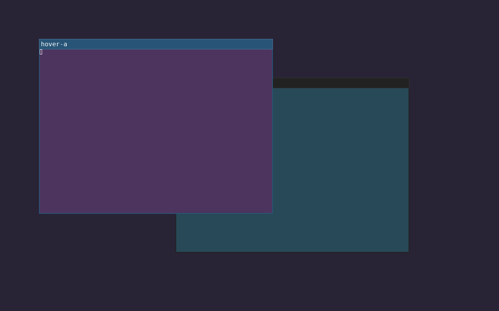

# Native pointer dwell raising

SwayFX `0.6-r2` is installed with `mouse_raise_delay`, a compositor setting that
preserves immediate focus-following and raises the same floating window after
one second of pointer dwell. `native-packaged/evidence.json` records 11 passing
checks against the executable extracted from the signed APK. Observed raising
was at 1.029 seconds; the half-second check still had the focused window below
its neighbor. Movement inside the target did not restart the timer.

The checks cover disabled defaults, raising an already focused floating view,
empty-space leave while focus remains, newer focus, workspace round trips,
geometry changes, disabling the feature, invalid values, held pointer buttons
and target destruction. The private compositor exited cleanly. These fixtures
read no live keyboard or pointer events. The screenshots show actual native
stacking before and after dwell:





The earlier `native-first` run records the ten-check prototype. The final patch
additionally rejects held-button starts; the final package was checked again.
`build.json` and `build.log` retain the offline build, source identity and 26
build dependency identities matching input lock `368a9c51ce0830f4e791`.
ShellCheck passes for APKBUILD with the normal abuild-injected variables and
package metadata exclusions (`SC2034`, `SC2154`). Python syntax checks pass.

## Exact package and installed closure

The signed package passed `apk --no-network verify`, then was archived and
exported again with matching SHA-256:

```text
sha256/471a36a1e34bc0c645b02dffe2b427575c336cecd8855573d7d3257f4e299327/swayfx-0.6-r2.apk
```

The executable SHA-256 is
`47737f93b5a6123eefc910e7acfbc575de0193e14e72e468ec77393d3bcc35b9`.
Installing this exact artifact offline upgraded only `swayfx`; the 1121-package
snapshot is `alpine/packages/locks/fec17adaeaa5972078b8.json`. It also preserves
the already installed `cliphist` and `wl-clip-persist` additions that had not yet
appeared in the preceding lock. Only the swayfx pin changed in the versioned
package world file.

All 1121 archived APK hashes verify. `closure.json` confirms that the full live
package database matches recorded installed architectures, versions and APK
identities, and that world, repositories and public keys match. The separate
`verify-root --root /` check reported 233 architecture-only differences because
it expects locally restored APK `noarch` metadata, whereas these original host
entries came from indexes recording `x86_64`. No package identity differs.

## Activation and recovery

The dedicated `sway/local.d/hover-raise.conf` is deployed. It selects 1000ms
through a quiet runtime IPC command, so old Sway versions still parse it.
The complete live configuration passed validation using the old running binary;
its unsupported runtime request returned status 2 with no output and no nag.

PID 3175 still runs the old executable with SHA-256
`ec6973644284dc52ece0bbd3e6fba4725be28f6212d7f5f62e687edd12a508f1`.
The installed replacement has the new hash above. **The new dwell behavior
starts at the next graphical login; this work did not restart the session.**
Physical pointer use in that new session, session-lock interaction and multiple
seats remain unobserved. The native checks used one private headless seat.

To disable the behavior in a patched session, run `swaymsg 'mouse_raise_delay 0'`
and set the include's value to zero. The scoped deployment can be reversed with
`alpine/bin/deploy-home --target "$HOME" --rollback` using backup
`~/.local/state/oldbook/backups/1788839554794457799`.

The previous signed r1 package remains archived for a package-only rollback:

```text
sha256/a3d37bf21b7cfb63b69237c12d7ef7003754ad01e05def5c727d37bf332afab4/swayfx-0.6-r1.apk
```

After any package rollback, snapshot the actual installed closure again.
Restoring the whole earlier lock would also change the clipboard additions;
use the retained r1 package when reversing only this compositor update.
