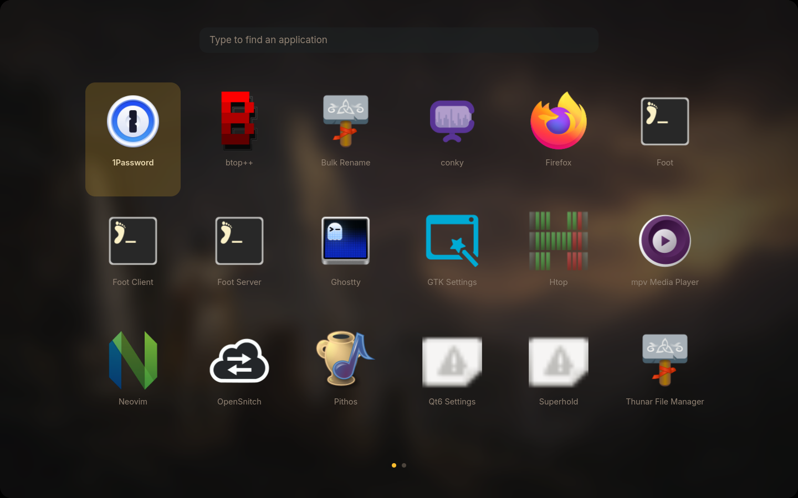
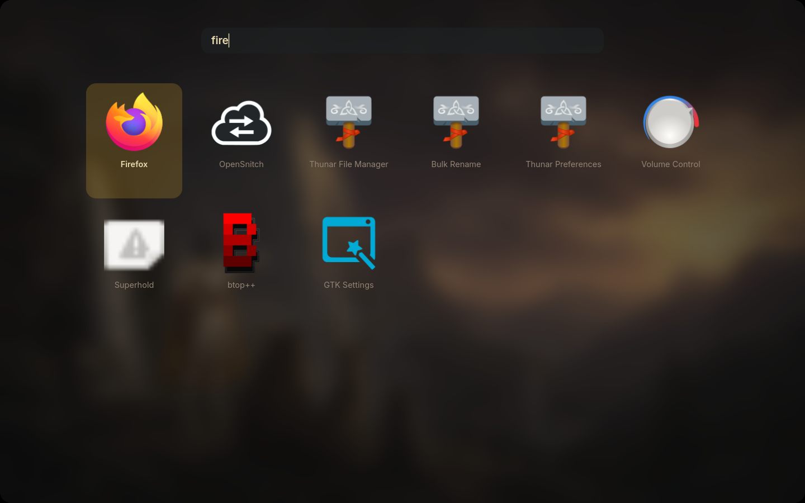
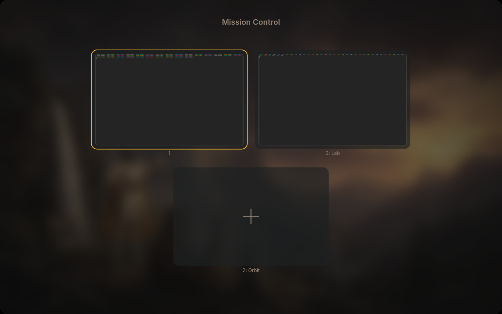
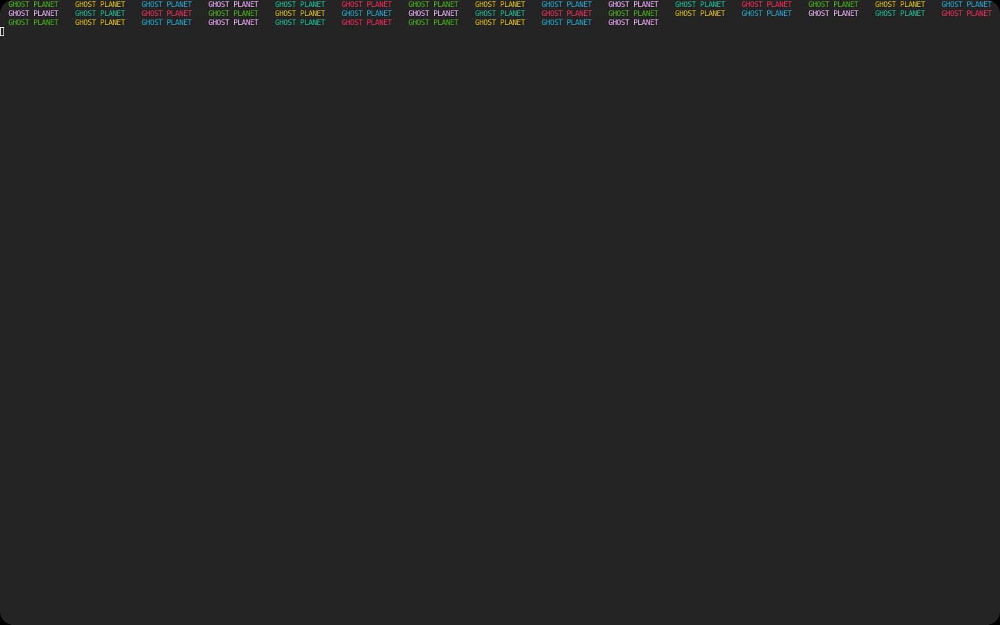

# Launchpad and Mission Control

Rendered by [`verify_grids.py`](../../tests/verify_grids.py) in a private headless
SwayFX session (pixman renderer, 1440×900) with a private HOME, runtime directory
and cache. The overlays are the real executables from this checkout, opened and
closed over their own control sockets. The user's live session is never touched.

```sh
python3 alpine/tests/verify_grids.py --output /tmp/grids
```

## Launchpad



Every application the XDG search path offers, drawn with the Oldbook-Gruvbox icon
theme over the current painting blurred by the lock scene's cache. The first cell
carries the selection. Two entries fall back to the theme's missing-icon glyph
because their desktop files name an icon this theme does not ship; that is the
intended fallback, not a failure.



The query `fire` ranks Firefox first, ahead of entries that merely contain the
letters. The harness sends `ffire` because `wtype` loses the first key of each
invocation while its virtual keyboard binds; the overlay received exactly `fire`,
which is what the search bar shows.

## Mission Control



Three cards: the focused workspace with an amber border, a second workspace, and
the card that creates the next one. The stills are real captures taken through
the window carousel's own provider (`grim -T <foreign toplevel>`), so a workspace
that was never visited is still photographed — the coloured band at the top of
each still is the terminal content the harness printed into those windows. Each
still sits on a surface with a thin edge so a dark window still reads as a window.



## What this does not prove

The pixman renderer draws no compositor blur, so the SwayFX blur behind the
overlay is absent here; the blurred painting in these shots is the overlay's own
texture. Frame pacing, the open and close animation in motion, pointer hover,
drag-to-move and the physical engraved F3/F4 keys are not visible in a still
capture and were checked separately or remain unobserved; the design note records
which is which.
