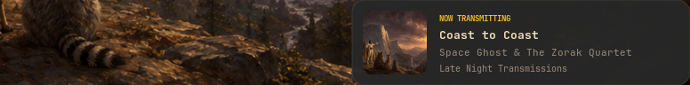

# Now transmitting



When the playing track changes, a card slides in at the bottom right of the
focused output for four seconds: album art, an amber eyebrow, the title, the
artist and the album, in the Gruvbox card style of the notification centre.
Without usable album art it falls back to a music glyph on a surface tile.


`report.json` is the full run of `alpine/tests/verify_osd.py`, which now covers
the card alongside the pill, the flash and Satty. Its card checks are:

| Check | Meaning |
| --- | --- |
| `card_on_overlay_layer` | The surface sits on the overlay layer, above ordinary windows. |
| `card_visible_while_held` | The corner changes brightness while the card is held. |
| `workspace_unchanged_while_card_shown` | The card reserves no space: the workspace rectangle is identical before and during. |
| `card_unmapped_after_hold` | After the hold and the slide out, the surface is gone and the corner matches the idle frame. |
| `card_suppressed_while_locked` | With a live lock readiness record present, an announcement maps nothing at all. |

The run was made in a private headless SwayFX session on the pixman renderer,
which has no blur, so these frames show the card's own drawing and not the
compositor's glass. Card geometry in the run: a 776x96 surface at (648, 788) on
a 1440x900 logical output, with the 380-wide card drawn at its right edge.

The suppression rule was also confirmed on the live desktop: with the session
locked by swayidle, `oldbook-osd card` mapped nothing.

```sh
python3 alpine/tests/verify_osd.py --output /tmp/osd-verify
python3 alpine/desktop/.local/bin/oldbook-osd preview-card --output /tmp/card.png
```
