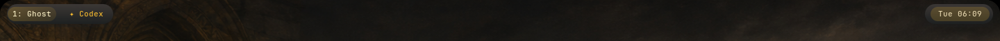
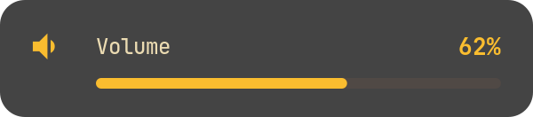
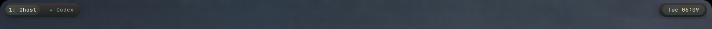
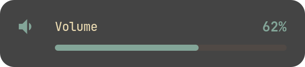

# The accent follows the painting

Two gallery paintings with opposite temperaments, put through the real
`oldbook-palette` helper in a private state directory, then photographed on the
two surfaces that carry the accent.

| Painting | Elected accent | Companion | Bar | Pill |
| --- | --- | --- | --- | --- |
| Crusader procession | yellow `#fabd2f` | orange `#fe8019` |  |  |
| Antarctic station | blue `#83a598` | purple `#d3869b` |  |  |

The procession is firelit and gives amber 93% of its colour. The polar station
splits its colour between the ice and the low sun, and blue takes the largest
share at 43%, so the desktop goes cold with it. Both accents are colours the
Gruvbox Dark descriptor already declares; nothing is sampled out of the canvas.

`evidence.json` records each election with its full scores and, for the bar, the
colour the badge *actually rendered*: `#ecb32e` under the procession and
`#7d9d90` under the station, the two accents as the compositor drew them rather
than as the stylesheet asked for them.

## Reproducing

```sh
python3 alpine/tests/verify_reactive_palette.py --output /tmp/reactive-palette
```

The helper runs against a private `XDG_STATE_HOME` and `XDG_CONFIG_HOME`, the
bar is mapped in a private headless SwayFX session, and the pill uses its own
display-free preview. The live session is never touched.

## Limits

The headless renderer is pixman, which has no blur, so the bar islands sit flat
here rather than over frosted glass. The bar configuration used for the shot
holds only the three modules the accent touches, so the evidence does not depend
on every desktop helper being installed; it is not a photograph of the full
control deck. The live panel was checked separately by advancing the gallery one
painting and back, recorded in the design note.
