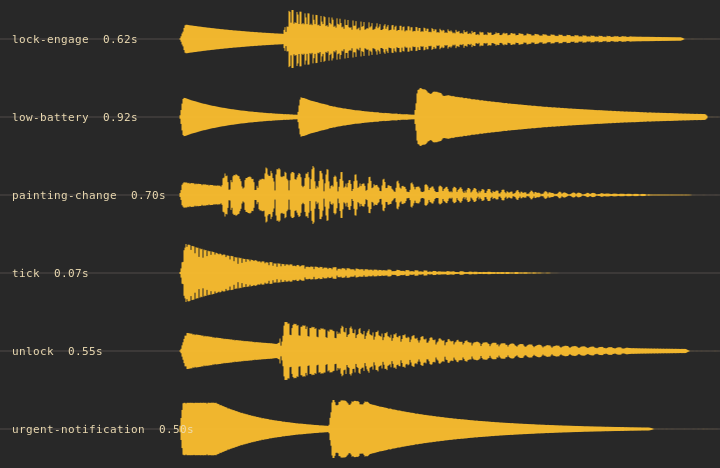

# Ghost Planet cues



Six sounds, none longer than a second, all made from scratch with numpy: sine and
triangle partials with a soft attack and an exponential tail, over a very quiet
bed of filtered noise standing in for studio room tone. Nothing was sampled,
recorded or downloaded. The sheet is drawn by
`alpine/bin/build-sound-theme --waveforms`, so it is the shipped audio rather
than an illustration of it. You can read the design straight off the picture: the
two notes falling shut in `lock-engage`, the same interval opening in `unlock`,
three patient pulses in `low-battery`, the four-note chime of `painting-change`,
the smallest possible `tick`, and the firm double blip of `urgent-notification`.

`evidence.json` records each cue's length, channel count, sample rate, peak and
RMS. Every cue normalises to exactly -12 dBFS, quiet enough to sit under a
conversation. `pw-play` rendered `unlock.wav` and exited zero with the sink
unmuted at forty percent, and all six were played once through
`oldbook-sound` during this pass.

```sh
python3 alpine/bin/build-sound-theme --waveforms /tmp/waveforms.png
oldbook-sound list && oldbook-sound painting-change
```

Limits: levels and exit codes are measurable, but whether these cues are pleasant
is a matter of taste and nobody has lived with them yet. They have been heard
once, quietly, on the built-in speakers. `oldbook-sound off` silences the set.
