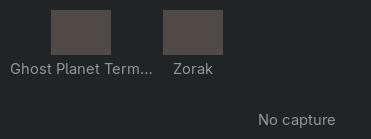

# Workspace peek



Rest the pointer on a workspace in the bar and, after a third of a second, its
windows appear beneath it: one card per window, each a still above a shortened
title. A window whose capture failed keeps its place with a plain tile, so the
peek never quietly drops a window from the count. Moving away closes it.

The picture above is what GTK drew for the peek's own widget row, saved by the
native fixture rather than photographed from a screen, because the desktop was
locked throughout this work. Its stills are a flat test colour; on the desktop
they are the compositor's own captures of the real windows.

`alpine/packages/waybar-art/tests/workspace-peek.c` drives the whole feature
under a private X server with a private HOME and a scripted stills helper, so
it never asks the real compositor to capture anything. Its 24 checks cover:

| Behaviour | Check |
| --- | --- |
| Sweeping past costs nothing | Leaving before the dwell elapses opens no peek, then or later. |
| Resting opens the peek | A popover attached to that button, named `oldbook-peek`, with one card per window. |
| Cards are still plus title | An image above a label, with long titles shortened to eighteen characters and an ellipsis. |
| A failed capture keeps its place | That window gets a card with a plain tile and its title. |
| Leaving closes it | The popover is gone and forgotten. |
| The label is not a different widget | Crossing into the button's own child keeps the peek open. |
| A workspace with no number is skipped | A renamed button asks the helper for nothing. |
| A broken helper is harmless | A helper that fails, prints nothing, prints nonsense, or reports no windows opens no popover. |
| Shutdown is clean | Deinit with a peek open, and with a peek still opening, leaves nothing behind. |

```sh
cc -std=c11 -D_GNU_SOURCE -Wall -Wextra -Werror -o /tmp/peek \
    alpine/packages/waybar-art/tests/workspace-peek.c alpine/packages/waybar-art/help.c \
    $(pkg-config --cflags --libs gtk+-3.0 json-glib-1.0)
Xvfb :77 -screen 0 1440x900x24 & DISPLAY=:77 /tmp/peek /tmp/peek-widgets.png
```

`report.json` records the module and package hashes for r11, both of whose
isolated builds were byte-identical, and the live state: the package installed,
Waybar restarted onto the new library, and the stills helper run once against
the real session. The peek has not been watched opening on the physical panel.
