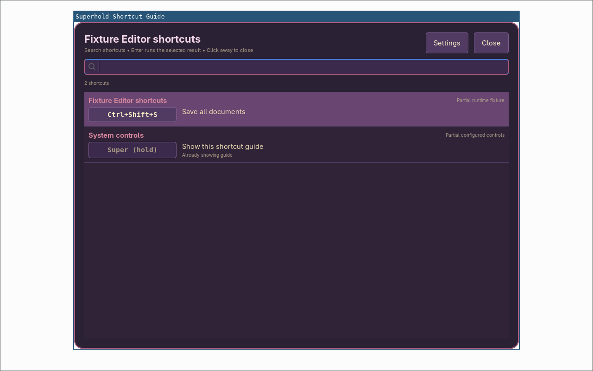
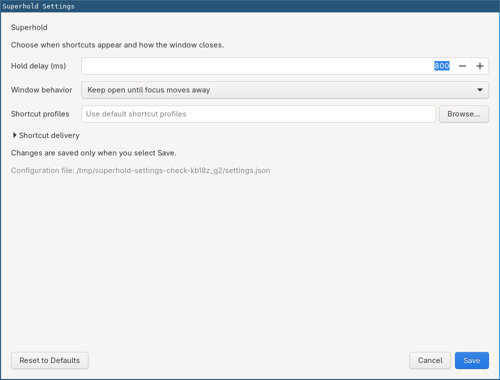

# Superhold

Open a contextual shortcut guide, choose an action with the mouse, and send
its native shortcut to the original application. The list starts with the
focused app, followed by Sway and applicable terminal or tmux controls.

Run **Superhold Shortcut Guide** from the application menu, or hold either
**Super** key alone for half a second while the daemon is running. By default,
the guide stays open after Super is released. Press either Super key again to
close it immediately, or move focus away. Keeping Super held after closing does
not reopen it; release the key before starting another hold.
Search, scroll, and click a shortcut; alternatives have separate buttons.
**Up/Down** selects a result, **Enter** runs it, and **Escape** closes the guide.
Search ignores case and requires every word to match the shortcut's keys,
description, or context.



This standalone application is a development candidate, `0.2.0.dev1`, for
**Sway and LXQt on Wayland using Sway**. Other LXQt compositors and X11 are
outside this backend's support. A full LXQt session has not yet been tested.
Persistent search is currently unavailable over fullscreen applications; an
unfocused guide dismisses after one second. This is a release blocker. License selection also remains pending. See
[release preparation](docs/RELEASING.md) and [validation](docs/VALIDATION.md).

The standalone checkout uses its own configuration and runtime paths. It does
not replace or modify the original installed Oldbook shortcut service.

## Run on Alpine

Use Python 3.10 or newer, Sway, GTK 3, PyGObject, GTK Layer Shell's introspection
bindings, and `wtype` for native shortcut delivery. Alpine runtime packages are
`python3`, `py3-gobject3`, `gtk+3.0`, `gtk-layer-shell`, and `wtype`. `tmux` is
optional. `loginctl` from elogind or systemd supplies graphical session activity
and lock hints. Superhold does not require systemd or an LXQt library.

After installing those dependencies, run inside your Sway session:

```sh
./bin/superhold --version
./bin/superhold show
./bin/superhold settings
./bin/superhold daemon
```

`show` is the default command. It asks an existing daemon to open the guide,
or runs a one-shot guide that exits after dismissal. `settings` opens a normal
desktop window and does not require a running Sway session. `daemon` enables
the Super hold gesture. A per-compositor process lock prevents duplicates.

The hold gesture and native activation require read access to the keyboard's
`/dev/input/event*` device, using permissions already granted to your user by
the operating system. Superhold does not change permissions, run as root, or
grab devices. `superhold status` reports the readable device count. The guide
can be browsed without keyboard access, but activation cannot verify that all
keys have been released. `superhold preview --seconds 5` is a timed reference
preview that does not open keyboard devices or send shortcuts.

For an isolated Python installation using your distribution's GI bindings:

```sh
python3 -m venv --system-site-packages .venv
.venv/bin/python -m pip install --no-deps .
.venv/bin/superhold show
```

If Alpine Python does not include `venv` or `pip`, install the corresponding
packaging tools from your enabled repositories, or use the source launcher.
The distribution supplies the native libraries; the wheel does not bundle them.

## Settings and configuration

The guide, search controls, and settings window follow your desktop's GTK theme
and font. Superhold uses the shared GTK background, text, and selection colors.
It also reloads `$XDG_CONFIG_HOME/gtk-3.0/gtk.css` (normally
`~/.config/gtk-3.0/gtk.css`) when the file changes, including replacement of a
symlink or its target. It checks periodically while windows are open;
no daemon restart is needed. Invalid or temporarily missing CSS keeps the last
working stylesheet. On LXQt, use the GTK appearance settings for GTK apps.
If your stylesheet imports other CSS files, update the top-level `gtk.css` too
when changing those files so the running app reloads them.

Open **Superhold Settings** from the application menu or the guide's
**Settings** button. Adjust the hold delay, window behavior, optional profile
file, and shortcut delivery timings. **Reset to Defaults** edits the form;
only **Save** writes the file. **Cancel** leaves it unchanged.



Settings live in `$XDG_CONFIG_HOME/superhold/config.json`, defaulting to
`~/.config/superhold/config.json`. A missing file uses these defaults:

```json
{
  "version": 1,
  "hold_delay_ms": 500,
  "dismiss_mode": "focus_loss",
  "key_delay_ms": 12,
  "release_timeout_ms": 5000,
  "profiles_path": ""
}
```

| Setting | Accepted values | Effect |
| --- | --- | --- |
| `hold_delay_ms` | Integer, 100–5000 | Time to hold Super alone before opening. |
| `dismiss_mode` | `focus_loss` or `release` | Keep the normal window until focus leaves, or use a nonfocusable layer that closes on Super release. |
| `key_delay_ms` | Integer, 0–250 | Delay between native key events. |
| `release_timeout_ms` | Integer, 250–30000 | Cancel a chosen shortcut if held keys do not become verifiably released in time. |
| `profiles_path` | Empty, absolute path, or `~/` path | Use the default shortcut profile file or select another one. |

Menu-launched `show` always opens the persistent guide, including when the hold
gesture is configured for release mode. A daemon checks settings once a second
while idle and applies valid changes before the next use. Invalid edits keep
the previous settings and report an error. Saving is atomic, preserves unknown
fields, and uses a private file; malformed files and symbolic links are refused.
`--config PATH` selects a different settings file.

## Shortcut coverage and activation

Sway's loaded main configuration and active mode come from IPC. Included files
are read from disk because Sway does not retain their loaded text in IPC;
reload Sway after editing those files. tmux bindings come from the running
server and active pane. These sources are parsed as data. Selecting a shortcut
sends its key sequence through `wtype`; it does not execute the command text
found in a binding or profile.

The guide hides before activation, waits for held keys to be released, verifies
the original application, restores its focus, and sends the native sequence.
Focus, process identity, session state, and input are checked around delivery.
Wayland does not offer an atomic operation that combines those checks with
keyboard injection, so a narrow timing race remains. Failed checks cancel
delivery and show an explanation.

Unsupported physical `bindcode`, device-specific, layout-specific, and mouse
bindings stay visible with disabled controls and a reason. Superhold does not
guess a native sequence for them.

App shortcuts are labeled **partial baselines**. They do not enumerate every
plugin, remapping, website, or application state. Unsupported apps retain the
surrounding Sway controls and show that app coverage is unavailable. Foreground
terminal detection currently supports Foot. Codex's versioned profile includes
its `/keymap` command for current mappings. Live accessibility action discovery
is planned separately; see the [accessibility roadmap](docs/accessibility-roadmap.md).

Add application profiles in `$XDG_CONFIG_HOME/superhold/shortcuts.json`, or
`~/.config/superhold/shortcuts.json` by default:

```json
{
  "profiles": {
    "writer": {
      "name": "Writer",
      "aliases": ["org.example.Writer"],
      "coverage": "Partial local profile",
      "rows": [{"key": "Ctrl+S", "description": "Save document"}]
    }
  }
}
```

`superhold dump` prints a snapshot as JSON. `--profiles PATH` overrides the
profile path from settings, and `--socket PATH` selects a Sway IPC socket.
`--help` and `--version` work outside a graphical session.

## Startup and operation

[LXQt integration](docs/LXQT.md) covers menu launchers and optional autostart.
For Sway startup, add this to the session configuration, using a full executable
path if `superhold` is not on the session's `PATH`:

```sway
exec_always --no-startup-id superhold daemon
```

Choose Sway startup or LXQt autostart. Package installation and the settings
window do not enable either automatically. Disable the startup entry and send
SIGTERM to the PID reported by `superhold status` to stop the daemon.

Pressed-key state remains in memory; typed content is not recorded. Superhold
reads focused app identity, same-user process names, Sway configuration, and
tmux tables. It does not read process arguments or terminal contents, and makes
no network requests. Native key events are sent only after explicit activation.
Service metadata lives under `$XDG_RUNTIME_DIR/superhold/`.

Active-session checks suppress the guide during session changes and when
logind reports a locked session. The compatible Oldbook lock readiness record
is also recognized. Other lockers require their own session isolation checks
before support is claimed.

```sh
python3 -m unittest discover -s tests -v
python3 -m build --no-isolation
desktop-file-validate share/applications/superhold.desktop
desktop-file-validate share/applications/superhold-settings.desktop
desktop-file-validate integrations/lxqt/superhold.desktop
```

Automated tests use synthetic input and isolated sockets. Graphical checks use
disposable compositor sessions. See [provenance](docs/PROVENANCE.md) and
[validation](docs/VALIDATION.md) for recorded checks and remaining release work.
