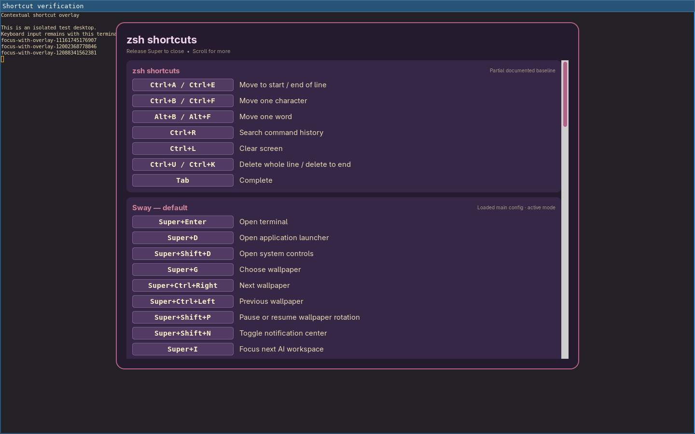

# Superhold

Hold either **Super** key alone for half a second to see the focused app's
shortcuts, then Sway's active bindings, then applicable terminal and tmux
controls. Scroll with the mouse or touchpad. Release Super or press another
key to close the guide; the overlay keeps keyboard focus in your app.

This is a **release preparation snapshot**, version `0.1.0.dev0`, extracted
from a working Alpine Sway setup. The initial compatibility target is **Sway
and LXQt on Wayland using Sway**. LXQt on X11, KWin, labwc, and other
compositors are not supported by this backend. LXQt session testing and a
license decision remain before a distributable release; see
[release preparation](docs/RELEASING.md).



The screenshot is from the original Alpine implementation, using an isolated
test terminal. The standalone package uses separate configuration and runtime
paths and does not replace the original service.

## Run on Alpine

Use Python 3.10 or newer, Sway, GTK 3, PyGObject, and GTK Layer Shell's
introspection bindings. On Alpine these runtime packages are `python3`,
`py3-gobject3`, `gtk+3.0`, and `gtk-layer-shell`. `tmux` is optional; `loginctl`
from elogind or systemd supplies graphical session activity and lock hints.
The package does not require systemd or an LXQt library.

After your package manager has installed those dependencies, run from this
source directory inside your Sway session:

```sh
./bin/superhold --version
./bin/superhold preview --seconds 5
./bin/superhold daemon
```

The daemon needs read access to the keyboard's `/dev/input/event*` device,
using permissions already granted to your user by the operating system. It
does not change permissions, run as root, or grab devices. `superhold status`
reports the readable device count; zero means the hold gesture is unavailable.
The preview command works without keyboard-device access.

For an isolated Python installation that can use your distribution's GI
bindings:

```sh
python3 -m venv --system-site-packages .venv
.venv/bin/python -m pip install --no-deps .
.venv/bin/superhold preview --seconds 5
```

If your Alpine Python does not include `venv`/`pip`, install the corresponding
Python packaging tools from your enabled Alpine repositories, or use the
source launcher. Native GTK libraries are supplied by the distribution,
not downloaded by this wheel.

## LXQt and startup

[LXQt integration](docs/LXQT.md) covers its application menu and XDG autostart.
The included menu entry offers a 30-second mouse-launchable preview with a
**Close preview** button. Rows are
reference text; clicking them does not execute actions. Accessibility-driven
action browsing is a future adapter, not part of this release preparation.

For Sway startup, put the following in the config used by your session, with
the full executable path if `superhold` is not on the session's `PATH`:

```sway
exec_always --no-startup-id superhold daemon
```

Choose either Sway startup or LXQt autostart. A per-compositor process lock
also prevents duplicates. Disable that startup entry and send SIGTERM to the
PID reported by `superhold status` to stop the service.

## What the list knows

Sway's loaded main configuration and active mode come from IPC. Included
configuration files are read from disk because Sway does not retain their
loaded text in IPC; reload Sway after changing those files. tmux tables come
from the running server and active pane. Both sources are parsed as data;
displayed commands are never executed.

App shortcuts are explicitly labeled **partial baselines**. They do not cover
every plugin, remapping, website or application state. Unsupported apps keep
the surrounding Sway controls and show that app coverage is unavailable.
The current terminal foreground adapter supports Foot; other terminals still
show their app profile, when one exists, plus Sway controls. Codex's versioned
profile links to its own `/keymap` command for current mappings.

Add application profiles in `$XDG_CONFIG_HOME/superhold/shortcuts.json`, or
`~/.config/superhold/shortcuts.json` by default:

```json
{
  "profiles": {
    "writer": {
      "name": "Writer",
      "aliases": ["org.example.Writer"],
      "coverage": "Partial local profile",
      "rows": [{"key": "Ctrl+S", "description": "Save document"}]
    }
  }
}
```

`superhold dump` prints a snapshot as JSON. `--profiles PATH` selects a profile
file and `--socket PATH` selects a Sway IPC socket explicitly. `--help` and
`--version` work outside a graphical session.

## Privacy and checks

The hold detector keeps pressed-key state only in memory. It never records
typed content, sends key events, reads process arguments or terminal contents,
or makes network requests. It reads focused app identity, same-user process
names, Sway configuration, and tmux key tables. Runtime status files live in
`$XDG_RUNTIME_DIR/superhold/` and contain service metadata only.

Active-session checks suppress the overlay when switching sessions and when
logind reports a locked session. The original Oldbook lock readiness record
is also recognized when present. Lockers that do not set `LockedHint` still
depend on the compositor's session-lock surface isolation; see the release
test matrix before making support claims for a different desktop.

```sh
python3 -m unittest discover -s tests -v
python3 -m build --no-isolation
desktop-file-validate share/applications/superhold.desktop
desktop-file-validate integrations/lxqt/superhold.desktop
```

Tests use synthetic input and isolated sockets. They never inject keys into
the running desktop. See [provenance](docs/PROVENANCE.md) and
[validation](docs/VALIDATION.md) for the distinction between inherited runtime
evidence and checks performed on this standalone package.
